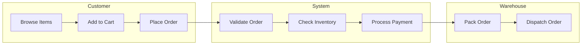
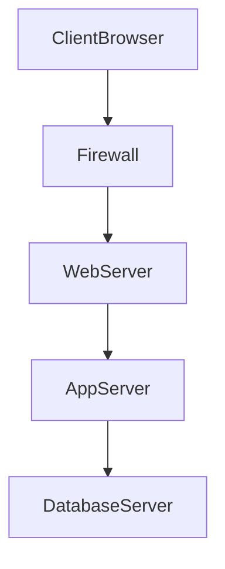

	2025-12-11 20:57

Status:

Tags:

---
# 2019

Below is the **complete solution to ALL questions** from the _UPES OOAD End Sem Dec 2019_ paper — correct, exam-ready, and clean.  
(Reference: your uploaded PDF )

---

## SECTION A

---

### Q1. Contrast between Behavioral and Structural Models (4 marks)

#### Structural Models

- Describe **static** aspects of the system.
    
- Represent classes, objects, attributes, operations, and relationships.
    
- Examples: **Class Diagram, Object Diagram, Component Diagram, Deployment Diagram**.
    
- Focus: _What the system contains_.
    

#### Behavioral Models

- Describe **dynamic** aspects of the system.
    
- Represent interactions and state changes over time.
    
- Examples: **Sequence Diagram, Activity Diagram, State Machine Diagram, Use Case Diagram**.
    
- Focus: _How the system behaves_.
    

---

### Q2. Total number of diagrams in UML + Three Amigos (1 + 3 marks)

- UML has **14 diagrams** (Group: Structural + Behavioral).
    

#### Three Amigos of UML:

1. **Grady Booch**
    
2. **James Rumbaugh**
    
3. **Ivar Jacobson**
    

---

### Q3. Explain Requirement Engineering + Best UML Diagram (4 marks)

#### Requirement Engineering

- Process of identifying, documenting, analyzing, and validating user needs.
    
- Steps: **Elicitation**, **Analysis**, **Specification**, **Validation**, **Management**.
    

#### Best suited UML diagram for functional requirements

✔ **Use Case Diagram**  
Because it identifies system actors and functional interactions.

---

### Q4. CRC cards + CRC for Customer placing an Order (4 marks)

#### CRC = Class–Responsibility–Collaborator cards

- Used to identify **candidate classes** in object-oriented design.
    
- Helps in brainstorming and assigning responsibilities to each class.
    

#### CRC Card: Customer placing an Order

```
+------------------------------------------------+
|                  Customer                      |
+------------------------------------------------+
| Responsibilities:                              |
|  • Select products                             |
|  • Add items to cart                           |
|  • Provide delivery & payment details          |
|  • Place order                                 |
+------------------------------------------------+
| Collaborators:                                 |
|  • ShoppingCart                                |
|  • Order                                       |
|  • Payment                                     |
+------------------------------------------------+

+------------------------------------------------+
|                ShoppingCart                    |
+------------------------------------------------+
| Responsibilities:                              |
|  • Hold selected items                         |
|  • Calculate subtotal                          |
|  • Update item quantity                        |
+------------------------------------------------+
| Collaborators:                                 |
|  • Customer                                    |
|  • Product                                     |
|  • Order                                       |
+------------------------------------------------+

+------------------------------------------------+
|                     Order                       |
+------------------------------------------------+
| Responsibilities:                              |
|  • Create order                                |
|  • Calculate total with tax                    |
|  • Update order status                         |
+------------------------------------------------+
| Collaborators:                                 |
|  • Customer                                    |
|  • ShoppingCart                                |
|  • Payment                                     |
+------------------------------------------------+

+------------------------------------------------+
|                   Payment                      |
+------------------------------------------------+
| Responsibilities:                              |
|  • Process payment                             |
|  • Validate transaction                        |
+------------------------------------------------+
| Collaborators:                                 |
|  • Customer                                    |
|  • Order                                       |
+------------------------------------------------+


```

---

### Q5. Swimlane Architecture (4 marks)

- Activity diagram variant where **activities are divided by responsibility**.
    
- Each lane = an actor/entity.
    
- Shows workflow + who performs each action.
    

#### Example (Online Shopping):

```
 ---------------------------------------------------------------
|      Customer       |        System         |   Warehouse     |
 ---------------------------------------------------------------
| Browse Items        |                      |                  |
| ------------------> |                      |                  |
| Add to Cart         |                      |                  |
| ------------------> | Validate Order       |                  |
| Place Order         | -------------------> |                  |
|                     | Check Inventory      |                  |
|                     | -------------------> |                  |
|                     | Process Payment      |                  |
|                     | -------------------> | Pack Order       |
|                     |                      | ---------------->|
|                     |                      | Dispatch Order   |
 ---------------------------------------------------------------

```



---

## SECTION B

---

### Q6. Object Dimension & Time Dimension + Sequence Diagram (4 + 6 marks)

#### Object Dimension

Shows **objects** involved during execution and how they collaborate.

#### Time Dimension

Shows **order of messages** over time in top-down vertical sequence.

---
#### Sequence Diagram — Room Reservation in Hotel Chain

(Multi-day, with GUI, availability check, constraints)

[[2020#Q9. Sequence Diagram for Hotel Room Reservation System|Sequence Diagram Here]]

---

### Q7. Two aspects of an object + Class vs Object diagram + POS Object Diagram (2 + 2 + 6 marks)

**Two Aspects of an Object:**

1. **State (Attributes):** The data or values the object holds at a specific moment (e.g., a car's color, speed).
    
2. **Behavior (Methods/Operations):** The actions the object can perform or how it responds to events (e.g., accelerate, brake).

#### Object Diagram vs Class Diagram

**Differentiation:**

- **Class Diagram:** Represents the _schema_ or blueprint. It shows classes, static relationships, and methods. It is abstract and general.
    
- **Object Diagram:** Represents a _snapshot_ of the system at a specific moment in time. It shows specific instances (objects) populated with real data values. It is concrete.

#### POS Object Diagram

![[Pasted image 20251211212415.png]]

---

### Q8. Advantages of Incremental Model + 4 Phases of RUP (4 + 6 marks)

- **Advantages of Incremental Models:**
    
    - **Early Delivery:** Critical functionality is delivered early.
        
    - **Feedback:** Users provide feedback on increments, reducing the risk of building the wrong product.
        
    - **Risk Management:** High-risk components can be tackled in earlier iterations.
        
    - **Flexibility:** Easier to accommodate changing requirements compared to Waterfall.
        
- **4 Phases of RUP (Rational Unified Process):**
    
    1. **Inception:** The team defines the scope, estimates costs/schedule, identifies risks, and establishes the business case. The goal is "Life Cycle Objectives."
        
    2. **Elaboration:** The team analyzes requirements in detail and establishes the architectural baseline. They prove the architecture works. The goal is "Life Cycle Architecture."
        
    3. **Construction:** The system is built. This involves coding, integration, and testing of the components. The goal is "Initial Operational Capability."
        
    4. **Transition:** The system is deployed to the end-users. Activities include beta testing, training, data migration, and bug fixing. The goal is "Product Release."

---

### Q9. Activity vs Action + Use of Activity diagram + Symbols + Pre/Postconditions (2 +2 +2 +4 marks)

- **Difference:**
    
    - **Action:** An atomic, non-interruptible step (e.g., "Add numbers").
        
    - **Activity:** A composite behavior composed of a sequence of actions (e.g., "Calculate Tax Return").
        
- **Scenario:** Activity diagrams are used to model workflows, business processes, or the logic of a complex algorithm (like a flowchart).
    
- **Basic Symbols:**
    
    - **Rounded Rectangle:** Action/Activity state.
        
    - **Diamond:** Decision node (branching) or Merge node.
        
    - **Solid Circle:** Initial Node (Start).
        
    - **Circle with Dot:** Final Node (End).
        
    - **Black Bar:** Fork (split into parallel) or Join (sync parallel threads).
        
- **Pre/Post Conditions:**
    
    - **Precondition:** What must be true _before_ the activity starts (e.g., User is logged in).
        
    - **Postcondition:** What is guaranteed to be true _after_ the activity ends (e.g., Database is updated).

---

### OR

#### Event & State + Example (3 + 7 marks)

[[2019#Q11 (Option 1) OO Approach + UML Building Blocks + Collaboration Diagrams (8 + 6 + 6 marks)|Check Here]]

---

## SECTION C

---

### Q10. Component Diagram + Uses + Limitations + Diagram (4 + 4 + 5 + 7 marks)

[[2020#Q12 (Option 1) Component Diagram + Use & Limitations|Check Here]]

---

### Q11 (Option 1): OO Approach + UML Building Blocks + Collaboration Diagrams (8 + 6 + 6 marks)

#### 1. The Object-Oriented Approach for Analysis and Design (OOAD)

The Object-Oriented (OO) approach is a software engineering methodology that models a system as a collection of interacting objects.1 Unlike procedural programming, which focuses on functions and logic, OOAD focuses on the **data objects** and the **operations** performed on them.

##### Core Concepts

- **Object:** A real-world entity with a unique identity, state (attributes), and behavior (methods).2 For example, a specific `Car` (Red, Toyota, Speed: 60mph).
    
- **Class:** A blueprint or template for creating objects.3 It defines the attributes and methods common to all objects of that type.4
    
- **Encapsulation:** Wrapping data (variables) and code (methods) together as a single unit.5 It restricts direct access to some of an object's components (information hiding).6
    
- **Inheritance:** A mechanism where a new class derives properties and characteristics from an existing class.7 This promotes code reusability.8
    
- **Polymorphism:** The ability of different classes to respond to the same message (method call) in different ways.9
    

##### The Two Phases of OOAD

###### A. Object-Oriented Analysis (OOA) — "The What"

The goal of OOA is to understand the problem domain and identify the requirements without worrying about implementation details.10

- **Focus:** Identifying the objects, their attributes, and their relationships.11
    
- **Outcome:** A conceptual model (often a domain model) that represents real-world entities.
    
- **Key Question:** _What is the system supposed to do?_
    

###### B. Object-Oriented Design (OOD) — "The How"

OOD takes the conceptual model produced in OOA and transforms it into a concrete specification for construction.12

- **Focus:** Defining software objects, database schemas, and communication protocols. It addresses constraints like performance, architecture, and technology stack.13
    
- **Outcome:** A detailed design model (class diagrams, sequence diagrams) ready for coding.
    
- **Key Question:** _How will the system be built to fulfill the requirements?_
    

---

#### 2. Unified Modeling Language (UML) and its Building Blocks

UML is the standard language for specifying, visualizing, constructing, and documenting the artifacts of software systems.14 It is not a programming language but a visual modeling language used to simplify the design process.

##### Basic Building Blocks of UML

The vocabulary of UML consists of three kinds of building blocks:15

###### A. Things

These are the most basic elements in a model.

1. **Structural Things:** The static parts of a model (e.g., **Class**, **Interface**, **Component**, **Node**, **Use Case**).16
    
2. **Behavioral Things:** The dynamic parts of a model. They represent behavior over time and space (e.g., **Interaction**, **State Machine**).17
    
3. **Grouping Things:** The organizational parts of a model (e.g., **Package**).
    
4. **Annotational Things:** The explanatory parts of a model (e.g., **Note**).18
    

###### B. Relationships

These tie the "Things" together.

1. **Dependency:** A "using" relationship where a change in one thing determines the meaning of another.
    
2. **Association:** A structural relationship that describes a set of links (e.g., a Teacher _teaches_ a Student).19
    
3. **Generalization:** An "is-a" relationship (Inheritance).20 The child shares the structure and behavior of the parent.21
    
4. **Realization:** A relationship where one element specifies a contract (interface) and another element guarantees to carry it out.
    

###### C. Diagrams

Diagrams are the graphical presentation of a set of elements.22 They are generally categorized into two groups:

- **Structural Diagrams (Static):** Class Diagram, Object Diagram, Component Diagram, Deployment Diagram.23
    
- **Behavioral Diagrams (Dynamic):** Use Case Diagram, Sequence Diagram, Collaboration Diagram, State Chart Diagram, Activity Diagram.24
    

---

#### 3. The Need for Collaboration Diagrams in Interaction Modeling

**Collaboration Diagrams** (renamed **Communication Diagrams** in UML 2.0) are a type of interaction diagram.25 While Sequence Diagrams focus on the _time ordering_ of messages, Collaboration Diagrams focus on the **structural organization** of the objects that send and receive messages.

##### Why do we need them?

1. Emphasizing Relationships over Time

In complex systems, it is often more important to understand who talks to whom rather than strictly when they talk. Collaboration diagrams display the object connections (links) clearly, making the network of relationships immediately visible.26

2. Spatial Organization

Because they do not use a timeline (like sequence diagrams), collaboration diagrams can be laid out spatially to resemble the static structure (Class Diagram) of the system. This helps developers visualize how the runtime interaction maps onto the static architecture.

3. Visualizing Complex Logic within a Context

If a specific operation involves a "web" of objects communicating in a cluster, a collaboration diagram is often easier to read than a very long, vertical sequence diagram.

4. Debugging Object Links

If an interaction fails, a collaboration diagram helps identify missing associations. If Object A needs to send a message to Object B, but there is no link between them in the collaboration diagram, it indicates a flaw in the static design.

### Comparison Table: Sequence vs. Collaboration

|**Feature**|**Sequence Diagram**|**Collaboration (Communication) Diagram**|
|---|---|---|
|**Primary Focus**|Time ordering of messages.|Structure and links between objects.|
|**Layout**|Vertical (Time runs down).|Free-form spatial layout.|
|**Use Case**|Best for visualizing the flow of control.|Best for visualizing the organization of objects.|
|**Readability**|Easier to see the chronological sequence.|Easier to see the static relationships.|

---

### OR (Option 2): SDLC + Deployment & Maintenance + Deployment Diagram

#### SDLC Phases

1. Requirement analysis
    
2. Design
    
3. Implementation
    
4. Testing
    
5. Deployment
    
6. Maintenance
    

#### Deployment Activities

- Install system
    
- Configure hardware/software
    
- Database setup
    
- User training
    

#### Maintenance Activities

- Bug fixing
    
- Updates and patches
    
- Enhancements
    
- Performance monitoring
    

#### Deployment Diagram — Enterprise Web Application



---
# Reference
