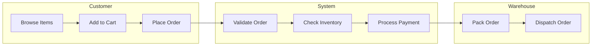
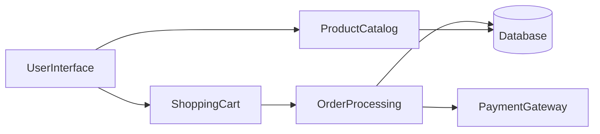
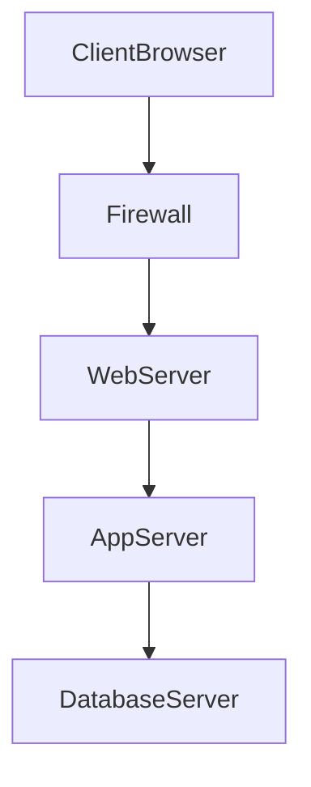

	2025-12-11 20:57

Status:

Tags:

---
# 2019

Below is the **complete solution to ALL questions** from the _UPES OOAD End Sem Dec 2019_ paper — correct, exam-ready, and clean.  
(Reference: your uploaded PDF )

---

## SECTION A

---

### Q1. Contrast between Behavioral and Structural Models (4 marks)

#### Structural Models

- Describe **static** aspects of the system.
    
- Represent classes, objects, attributes, operations, and relationships.
    
- Examples: **Class Diagram, Object Diagram, Component Diagram, Deployment Diagram**.
    
- Focus: _What the system contains_.
    

#### Behavioral Models

- Describe **dynamic** aspects of the system.
    
- Represent interactions and state changes over time.
    
- Examples: **Sequence Diagram, Activity Diagram, State Machine Diagram, Use Case Diagram**.
    
- Focus: _How the system behaves_.
    

---

### Q2. Total number of diagrams in UML + Three Amigos (1 + 3 marks)

- UML has **14 diagrams** (Group: Structural + Behavioral).
    

#### Three Amigos of UML:

1. **Grady Booch**
    
2. **James Rumbaugh**
    
3. **Ivar Jacobson**
    

---

### Q3. Explain Requirement Engineering + Best UML Diagram (4 marks)

#### Requirement Engineering

- Process of identifying, documenting, analyzing, and validating user needs.
    
- Steps: **Elicitation**, **Analysis**, **Specification**, **Validation**, **Management**.
    

#### Best suited UML diagram for functional requirements

✔ **Use Case Diagram**  
Because it identifies system actors and functional interactions.

---

### Q4. CRC cards + CRC for Customer placing an Order (4 marks)

#### CRC = Class–Responsibility–Collaborator cards

- Used to identify **candidate classes** in object-oriented design.
    
- Helps in brainstorming and assigning responsibilities to each class.
    

#### CRC Card: Customer placing an Order

```
+------------------------------------------------+
|                  Customer                      |
+------------------------------------------------+
| Responsibilities:                              |
|  • Select products                             |
|  • Add items to cart                           |
|  • Provide delivery & payment details          |
|  • Place order                                 |
+------------------------------------------------+
| Collaborators:                                 |
|  • ShoppingCart                                |
|  • Order                                       |
|  • Payment                                     |
+------------------------------------------------+

+------------------------------------------------+
|                ShoppingCart                    |
+------------------------------------------------+
| Responsibilities:                              |
|  • Hold selected items                         |
|  • Calculate subtotal                          |
|  • Update item quantity                        |
+------------------------------------------------+
| Collaborators:                                 |
|  • Customer                                    |
|  • Product                                     |
|  • Order                                       |
+------------------------------------------------+

+------------------------------------------------+
|                     Order                       |
+------------------------------------------------+
| Responsibilities:                              |
|  • Create order                                |
|  • Calculate total with tax                    |
|  • Update order status                         |
+------------------------------------------------+
| Collaborators:                                 |
|  • Customer                                    |
|  • ShoppingCart                                |
|  • Payment                                     |
+------------------------------------------------+

+------------------------------------------------+
|                   Payment                      |
+------------------------------------------------+
| Responsibilities:                              |
|  • Process payment                             |
|  • Validate transaction                        |
+------------------------------------------------+
| Collaborators:                                 |
|  • Customer                                    |
|  • Order                                       |
+------------------------------------------------+


```

---

### Q5. Swimlane Architecture (4 marks)

- Activity diagram variant where **activities are divided by responsibility**.
    
- Each lane = an actor/entity.
    
- Shows workflow + who performs each action.
    

#### Example (Online Shopping):

```
 ---------------------------------------------------------------
|      Customer       |        System         |   Warehouse     |
 ---------------------------------------------------------------
| Browse Items        |                      |                  |
| ------------------> |                      |                  |
| Add to Cart         |                      |                  |
| ------------------> | Validate Order       |                  |
| Place Order         | -------------------> |                  |
|                     | Check Inventory      |                  |
|                     | -------------------> |                  |
|                     | Process Payment      |                  |
|                     | -------------------> | Pack Order       |
|                     |                      | ---------------->|
|                     |                      | Dispatch Order   |
 ---------------------------------------------------------------

```



---

## SECTION B

---

### Q6. Object Dimension & Time Dimension + Sequence Diagram (4 + 6 marks)

#### Object Dimension

Shows **objects** involved during execution and how they collaborate.

#### Time Dimension

Shows **order of messages** over time in top-down vertical sequence.

---
#### Sequence Diagram — Room Reservation in Hotel Chain

(Multi-day, with GUI, availability check, constraints)

[[2020#Q9. Sequence Diagram for Hotel Room Reservation System|Sequence Diagram Here]]

---

### Q7. Two aspects of an object + Class vs Object diagram + POS Object Diagram (2 + 2 + 6 marks)

**Two Aspects of an Object:**

1. **State (Attributes):** The data or values the object holds at a specific moment (e.g., a car's color, speed).
    
2. **Behavior (Methods/Operations):** The actions the object can perform or how it responds to events (e.g., accelerate, brake).

#### Object Diagram vs Class Diagram

**Differentiation:**

- **Class Diagram:** Represents the _schema_ or blueprint. It shows classes, static relationships, and methods. It is abstract and general.
    
- **Object Diagram:** Represents a _snapshot_ of the system at a specific moment in time. It shows specific instances (objects) populated with real data values. It is concrete.

#### POS Object Diagram

![[Pasted image 20251211212415.png]]

---

### Q8. Advantages of Incremental Model + 4 Phases of RUP (4 + 6 marks)

- **Advantages of Incremental Models:**
    
    - **Early Delivery:** Critical functionality is delivered early.
        
    - **Feedback:** Users provide feedback on increments, reducing the risk of building the wrong product.
        
    - **Risk Management:** High-risk components can be tackled in earlier iterations.
        
    - **Flexibility:** Easier to accommodate changing requirements compared to Waterfall.
        
- **4 Phases of RUP (Rational Unified Process):**
    
    1. **Inception:** The team defines the scope, estimates costs/schedule, identifies risks, and establishes the business case. The goal is "Life Cycle Objectives."
        
    2. **Elaboration:** The team analyzes requirements in detail and establishes the architectural baseline. They prove the architecture works. The goal is "Life Cycle Architecture."
        
    3. **Construction:** The system is built. This involves coding, integration, and testing of the components. The goal is "Initial Operational Capability."
        
    4. **Transition:** The system is deployed to the end-users. Activities include beta testing, training, data migration, and bug fixing. The goal is "Product Release."

---

### Q9. Activity vs Action + Use of Activity diagram + Symbols + Pre/Postconditions (2 +2 +2 +4 marks)

- **Difference:**
    
    - **Action:** An atomic, non-interruptible step (e.g., "Add numbers").
        
    - **Activity:** A composite behavior composed of a sequence of actions (e.g., "Calculate Tax Return").
        
- **Scenario:** Activity diagrams are used to model workflows, business processes, or the logic of a complex algorithm (like a flowchart).
    
- **Basic Symbols:**
    
    - **Rounded Rectangle:** Action/Activity state.
        
    - **Diamond:** Decision node (branching) or Merge node.
        
    - **Solid Circle:** Initial Node (Start).
        
    - **Circle with Dot:** Final Node (End).
        
    - **Black Bar:** Fork (split into parallel) or Join (sync parallel threads).
        
- **Pre/Post Conditions:**
    
    - **Precondition:** What must be true _before_ the activity starts (e.g., User is logged in).
        
    - **Postcondition:** What is guaranteed to be true _after_ the activity ends (e.g., Database is updated).

---

### OR

#### Event & State + Example (3 + 7 marks)

##### Event

Trigger causing transition.

##### State

Condition in lifecycle of object.

##### State Machine Example: ATM

- Idle → Card Inserted → Pin Verified → Transaction → Card Returned.
    

---

## SECTION C

---

### Q10. Component Diagram + Uses + Limitations + Diagram (4 + 4 + 5 + 7 marks)

#### Uses of Component Diagram

- Models **physical modules** of system.
    
- Shows source code structure.
    
- Helps deployment team understand executables.
    

#### Usefulness

- Shows system decomposition
    
- Helps integration testing
    
- Reveals dependencies
    
- Facilitates reuse
    
- Supports large-scale systems
    

#### Limitations of top-down approach

1. Hard to accommodate changes
    
2. High dependency on initial requirements
    
3. Longer design time
    
4. Risk of faulty decomposition
    
5. Not suitable for dynamic systems
    

---

#### Component Diagram — Online Store



---

### Q11 (Option 1): OO Approach + UML Building Blocks + Collaboration Diagrams (8 + 6 + 6 marks)

#### Object-Oriented Approach

- Focuses on objects rather than functions.
    
- Emphasizes abstraction, inheritance, encapsulation, polymorphism.
    

#### UML Building Blocks

1. **Things** – structural, behavioral, grouping, annotation
    
2. **Relationships** – association, dependency, generalization
    
3. **Diagrams** – structural & behavioral diagrams
    

#### Need of Collaboration Diagrams

- Show how objects work together.
    
- Useful for understanding object communication.
    
- Complements sequence diagrams.
    

---

### OR (Option 2): SDLC + Deployment & Maintenance + Deployment Diagram

#### SDLC Phases

1. Requirement analysis
    
2. Design
    
3. Implementation
    
4. Testing
    
5. Deployment
    
6. Maintenance
    

#### Deployment Activities

- Install system
    
- Configure hardware/software
    
- Database setup
    
- User training
    

#### Maintenance Activities

- Bug fixing
    
- Updates and patches
    
- Enhancements
    
- Performance monitoring
    

#### Deployment Diagram — Enterprise Web Application



---
# Reference
