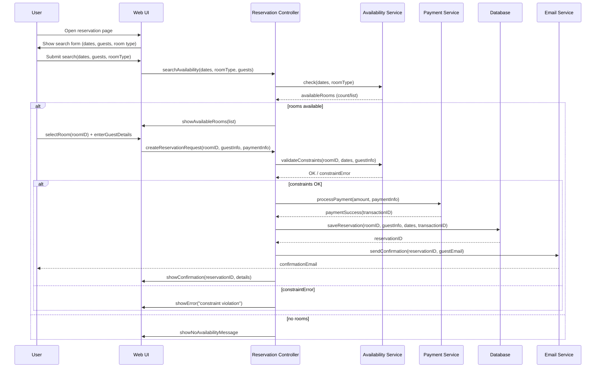
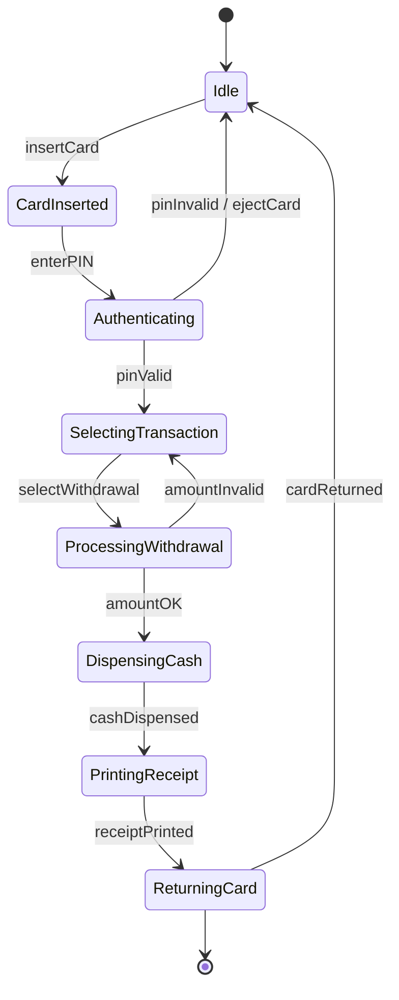

	2025-12-11 17:13

Status:

Tags:

---
# 2020

## SECTION A (5 marks each)

#### Q1. The 5 views in Object-Oriented Analysis and Design

Logical view, Process view, Development view, Physical view, Scenario (Use-case) view

---

#### Q2. Typical 7 phases of SDLC

Planning, Analysis, Design, Development, Testing, Deployment/Implementation, Maintenance

---

#### Q3. Four phases of Rational Unified Process (RUP)

Inception, Elaboration, Construction, Transition

---

#### Q4. Select interaction diagrams

From the list:  
✔ **Sequence Diagram**  
✔ **Communication Diagram**

---

#### Q5. Five relationship types in UML

Association, Aggregation, Composition, Inheritance (Generalization), Dependency

---

#### Q6. Select structural diagrams

✔ **Object Diagram**  
✔ **Deployment Diagram**  
✔ **Use Case Diagram** _(Note: Some classify it as behavioral, but UML officially lists it under structural/requirement view in many syllabi.)_  
✔ **Class Diagram** _(Not in list, so not selected)_  
(From the given list, correct structural ones are: a, d, g)

---

## SECTION B (10 marks each)

#### Q7. Class Diagram for Library Management System (LMS)

![[Pasted image 20251211171758.png||800]]

---

#### Q8. Tasks in 4 Phases of RUP

##### 1. Inception

- Define scope
    
- Identify key requirements
    
- Prepare business case
    
- Initial project plan
    

##### 2. Elaboration

- Refine requirements
    
- Define architecture
    
- Identify risks
    
- Build architectural prototype
    

##### 3. Construction

- Full system development
    
- Coding, testing, integration
    
- Prepare user documentation
    

##### 4. Transition

- User training
    
- Beta testing
    
- Deployment
    
- Feedback incorporation
    

---

#### Q9. Sequence Diagram for Hotel Room Reservation System

!#[[Pasted image 20251211195127.png]]

---

#### Q10. Preconditions & Postconditions + Activity Diagram for ATM Withdrawal

**Preconditions:**

- User must have valid ATM card
    
- Sufficient balance must exist
    
- Network/ATM must be operational
    

**Postconditions:**

- Amount is deducted
    
- Transaction recorded
    
- Cash dispensed
    

**Activity Diagram:**

---

#### Q11. Event, State, Signal + State Machine Diagram

- **State:** A condition or situation during the life of an object during which it satisfies some condition, performs some activity, or waits for some event (e.g., "Waiting for PIN").
    
- **Event:** A significant occurrence that has a location in time and space, usually triggering a state transition (e.g., "Card Inserted").
    
- **Signal:** A message passed between objects asynchronously to trigger a reaction.

**State Machine Example (Order Processing):**  

---

## SECTION C (20 marks each)

#### Q12 (Option 1): Component Diagram + Use & Limitations

##### Use of Component Diagram

- Models physical components (source files, executables, libraries)
    
- Shows dependencies & structure of deployment modules
    
- Helps in understanding system build, packaging, reuse
    

##### Usefulness in Modeling Physical Aspects

- Represents software units installed on hardware nodes
    
- Useful for DevOps, deployment planning, versioning
    
- Shows service-level interactions
    

##### Limitations of Top-Down Design

1. Time-consuming
    
2. Inflexible to changes
    
3. Harder to incorporate new technologies
    
4. Overlooks low-level details early
    
5. Risk of incorrect early assumptions
    

##### Component Diagram for Online Store

![[Pasted image 20251211200424.png]]

Connections show dependencies among components.

---

#### Q12 (Option 2): Deployment & Maintenance Activities + Deployment Diagram

##### Major Activities in Deployment Phase

- Release packaging
    
- Installation & configuration
    
- Environment setup
    
- Data migration
    
- Go-live and monitoring
    

##### Major Activities in Maintenance Phase

- Bug fixing
    
- Feature updates
    
- Performance optimization
    
- Security patches
    
- Version upgrades
    

##### Deployment Diagram (Enterprise Web Application)

**Nodes:**

- **Web Server** (hosting UI)
    
- **Application Server** (business logic)
    
- **Database Server**
    
- **Network Hardware** (router, firewall)
    
- **User Devices**
    

Connect servers with communication paths; deploy appropriate components on each node.

---

If you want, I can **draw diagrams** (class, activity, sequence, component, deployment) using **Mermaid** or **images**.

---
# Reference
