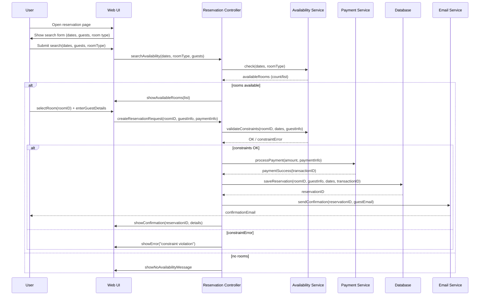
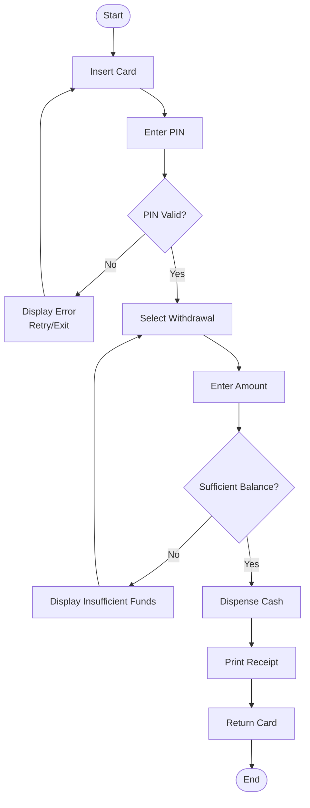
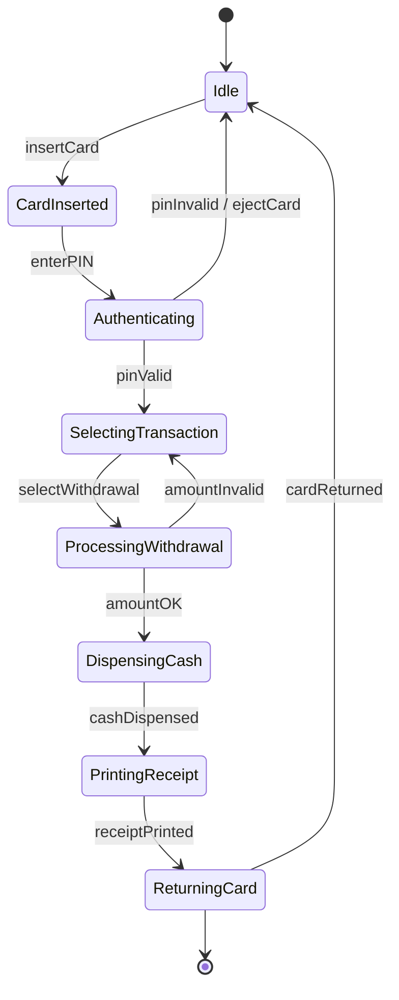

	2025-12-11 17:13

Status:

Tags:

---
# 2020

## SECTION A (5 marks each)

#### Q1. The 5 views in Object-Oriented Analysis and Design

Logical view, Process view, Development view, Physical view, Scenario (Use-case) view

---

#### Q2. Typical 7 phases of SDLC

Planning, Analysis, Design, Development, Testing, Deployment/Implementation, Maintenance

---

#### Q3. Four phases of Rational Unified Process (RUP)

Inception, Elaboration, Construction, Transition

---

#### Q4. Select interaction diagrams

From the list:  
✔ **Sequence Diagram**  
✔ **Communication Diagram**

---

#### Q5. Five relationship types in UML

Association, Aggregation, Composition, Inheritance (Generalization), Dependency

---

#### Q6. Select structural diagrams

✔ **Object Diagram**  
✔ **Deployment Diagram**  
✔ **Use Case Diagram** _(Note: Some classify it as behavioral, but UML officially lists it under structural/requirement view in many syllabi.)_  
✔ **Class Diagram** _(Not in list, so not selected)_  
(From the given list, correct structural ones are: a, d, g)

---

## SECTION B (10 marks each)

#### Q7. Class Diagram for Library Management System (LMS)

![[Pasted image 20251211171758.png||800]]

---

#### Q8. Tasks in 4 Phases of RUP

##### 1. Inception

- Define scope
    
- Identify key requirements
    
- Prepare business case
    
- Initial project plan
    

##### 2. Elaboration

- Refine requirements
    
- Define architecture
    
- Identify risks
    
- Build architectural prototype
    

##### 3. Construction

- Full system development
    
- Coding, testing, integration
    
- Prepare user documentation
    

##### 4. Transition

- User training
    
- Beta testing
    
- Deployment
    
- Feedback incorporation
    

---

#### Q9. Sequence Diagram for Hotel Room Reservation System

!#[[Pasted image 20251211195127.png]]

---

#### Q10. Preconditions & Postconditions + Activity Diagram for ATM Withdrawal

**Preconditions:**

- User must have valid ATM card
    
- Sufficient balance must exist
    
- Network/ATM must be operational
    

**Postconditions:**

- Amount is deducted
    
- Transaction recorded
    
- Cash dispensed
    

**Activity Diagram:**

---

#### Q11. Event, State, Signal + State Machine Diagram

- **State:** A condition or situation during the life of an object during which it satisfies some condition, performs some activity, or waits for some event (e.g., "Waiting for PIN").
    
- **Event:** A significant occurrence that has a location in time and space, usually triggering a state transition (e.g., "Card Inserted").
    
- **Signal:** A message passed between objects asynchronously to trigger a reaction.

**State Machine Example (Order Processing):**  

---

## SECTION C (20 marks each)

#### Q12 (Option 1): Component Diagram + Use & Limitations

##### 1. The Use of Component Diagrams

A **Component Diagram** is a structural UML diagram that depicts how a software system is split up into components and shows the dependencies among these components.

In the context of UML, a "Component" represents a modular part of a system that encapsulates its contents and whose manifestation is replaceable within its environment.

###### Elaborating Usefulness in Modeling Physical Aspects

While class diagrams represent the abstract _logical_ structure of the code, Component Diagrams represent the **physical** packaging of the code. They bridge the gap between the design and the actual implementation files.

Here is why they are essential for modeling physical aspects:

- **Visualization of Implementation Artifacts:** They model actual files such as source code files (`.java`, `.cpp`), binary libraries (`.dll`, `.jar`), executables (`.exe`), and scripts. This helps developers understand exactly what files need to be created or deployed.
    
- **Dependency Management:** They clearly illustrate how different libraries or modules depend on one another. If a "Shopping Cart" component depends on a "Payment Gateway" component, the diagram visualizes this link. This is crucial for understanding how a change in one physical file might break another.
    
- **Interface Definition (Wiring):** Components communicate via **interfaces** (represented by "lollipops" and "sockets" in UML). This models the physical "wiring" of the system, defining exactly what inputs a module requires and what outputs it provides, facilitating a "plug-and-play" architecture.
    
- **System Partitioning:** They allow architects to group classes into cohesive physical units (modules/subsystems). This helps in managing complexity by treating a group of 50 classes as a single physical "Component."
    
- **Build Order Strategy:** By looking at the dependency arrows in a component diagram, release engineers can determine the correct order in which to compile and build the system (identifying which libraries must be built first).
    

---

##### 2. Limitations of the Top-Down Approach

The Top-Down approach (also known as step-wise refinement) involves breaking a major system down into subsystems, which are then broken down into smaller modules. While logical, it has several significant drawbacks in practical system design.

###### Five Key Limitations

1. Risk of Low-Level Infeasibility
    
    The biggest danger is assuming that the high-level design can be easily implemented at the bottom level. You might design a perfect architectural structure, only to discover weeks later that the specific technology or hardware cannot support the low-level operations required to make it work.
    
2. Difficulty in Component Reusability
    
    In top-down design, lower-level modules are created specifically to satisfy the requirements of the higher-level module above them. This creates highly specific, tightly coupled modules that are difficult to detach and reuse in other parts of the system or in future projects.
    
3. Delayed Testing and Integration (The "Big Bang" Risk)
    
    Since the lowest-level concrete modules are built last, you often cannot test the system's actual functionality until the very end of the project. This leads to a "Big Bang" integration phase where meaningful testing is delayed, and errors discovered late are expensive to fix.
    
4. Rigidity Against Changes
    
    The approach assumes the requirements are perfectly understood at the beginning (at the top). If a requirement changes or a high-level error is found halfway through, it often requires cascading changes down through the entire hierarchy, invalidating much of the work done on lower levels.
    
5. Abstraction Overload
    
    Designers can suffer from "Analysis Paralysis." Spending too much time trying to perfect the high-level abstract breakdown without writing any concrete code can lead to over-engineering. It separates the design process from the reality of the implementation environment.
    

##### Component Diagram for Online Store

![[Pasted image 20251211200424.png]]

Connections show dependencies among components.

---

#### Q12 (Option 2): Deployment & Maintenance Activities + Deployment Diagram

##### Major Activities in Deployment Phase

- Release packaging
    
- Installation & configuration
    
- Environment setup
    
- Data migration
    
- Go-live and monitoring
    

##### Major Activities in Maintenance Phase

- Bug fixing
    
- Feature updates
    
- Performance optimization
    
- Security patches
    
- Version upgrades
    

##### Deployment Diagram (Enterprise Web Application)

![[Pasted image 20251211200923.png]]

Connect servers with communication paths; deploy appropriate components on each node.

---
# Reference
