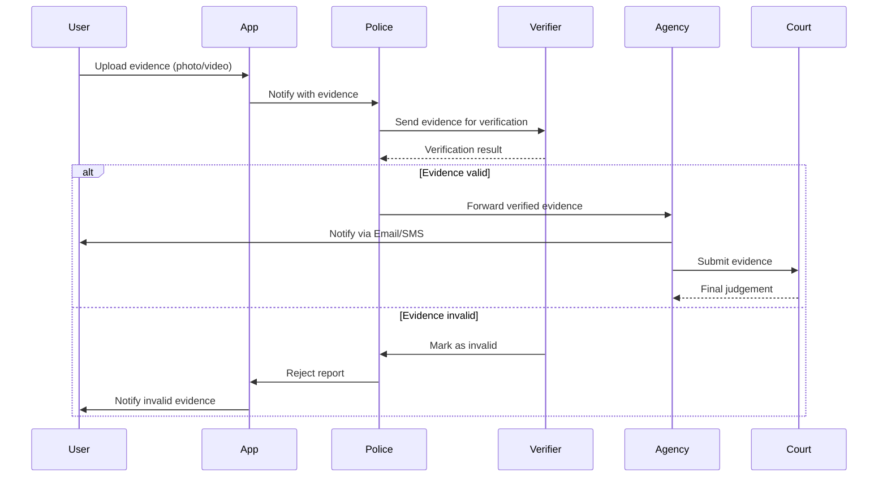
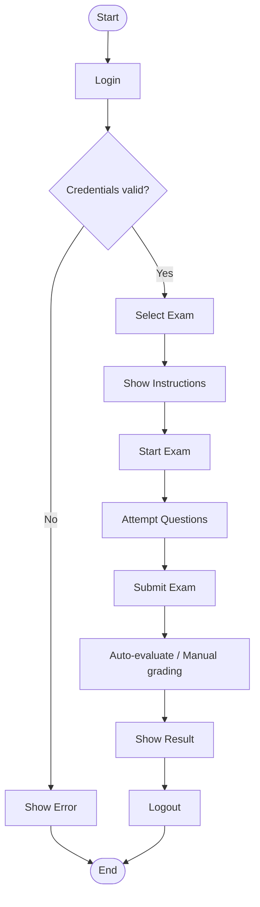

	2025-12-11 20:09

Status:

Tags:

---
# 2021

---

## SECTION A

---

### Q1. Why is modelling required? How UML helps in modelling? (2×2)

#### Why modelling is required

1. It simplifies complex real-world systems by representing them using diagrams.
    
2. Helps understand, analyze, design, and communicate system structure & behavior.
    
3. Reduces ambiguity in requirements.
    
4. Enables early error detection.
    

#### How UML helps

1. UML provides standardized diagrams (class, sequence, use case, etc.).
    
2. Helps visualize system architecture from multiple views.
    
3. Ensures common understanding between developers, clients, analysts.
    
4. Supports documentation and system maintenance.
    

---

### Q2. Define the following terms (4×1)

#### i. Do Activity

- An ongoing action performed while an object is in a particular **state** in a state machine.
    
- It continues until an event interrupts or the state changes.
    

#### ii. Association Class

- A class attached to an association (relationship) to store additional attributes (e.g., _Enrollment_ between _Student_ and _Course_ storing grades).
    

#### iii. Extend Relationship

- Use case relationship where an additional optional behavior **extends** a base use case.
    
- Triggered under certain conditions.
    
- Example: _“Apply Discount” extends “Make Payment”_.
    

#### iv. Collaborators

- Objects/classes that work together to perform a task or realize a use case.
    
- Represented in sequence, collaboration, and CRC models.
    

---

### Q3. Types of requirements in Requirement Engineering (4)

1. **Functional Requirements**  
    – What the system should do (features, services).
    
2. **Non-Functional Requirements**  
    – Performance, reliability, security, usability, availability.
    
3. **User Requirements**  
    – High-level descriptions expected by users.
    
4. **System Requirements**  
    – Detailed, structured specifications for developers.
    
5. **Interface Requirements**  
    – Interaction requirements with hardware, software, and users.
    

---

### Q4. Categorize relationships (4×1)

a) **Mobile is Windows Mobile or Android.**  
✔ _Generalization_  
Justification: Windows and Android are types of Mobile.

b) **Bluetooth connects laptops and Tab.**  
✔ _Association_  
Justification: Simple connection relationship; neither is part of the other.

c) **Processor and RAM are parts of a computer.**  
✔ _Composition_  
Justification: Computer cannot function without them; strong “part-of” relationship.

d) **A browser window has multiple tab windows.**  
✔ _Aggregation_  
Justification: Tabs can exist independently; browser contains them weakly.

---

### Q5. Nodes vs Components + examples (2×2)

#### Nodes

- Physical resources where components execute.
    
- Examples:
    
    1. Application Server
        
    2. Database Server
        

#### Components

- Modular, deployable units of software.
    
- Examples:
    
    1. Login Module
        
    2. Payment Module
        

---

## SECTION B

---

### Q6. Deployment Diagram — College Library Management System (10)

![[Pasted image 20251211202401.png||500]]

---

### Q7. Use Case Diagram — Online Job Portal (10)

![[Pasted image 20251211203139.png]]

---

### Q8. Sequence Diagram — Crime Reporting App (10)

---

### Q9. Activity Diagram OR Swimlane — Codetantra Online Exam (10)

#### Activity Diagram

#### Swimlane Diagram
![[Pasted image 20251211204259.png]]

---

## SECTION C

---

### Q10(a) Class Diagram — News Agency (UttrakhandNow) (10)

![[Pasted image 20251211204544.png]]

---

### Q10(b) Object Diagram of Given Graph (10)

![[Pasted image 20251211204857.png]]

---

### Q11(a) Types of Events in State Diagram (10)

**Types of Events:**

1. **Signal Event:** Reception of an asynchronous signal (e.g., `PacketReceived`).
    
2. **Call Event:** Synchronous request to invoke an operation (e.g., `makeReservation()`).
    
3. **Time Event:** Occurrence of a specific time or elapsed duration (e.g., `after(5 seconds)`).
    
4. **Change Event:** A condition becoming true (e.g., `when(capacity == full)`).

---

### Q11(b) State Diagram — Train Ticket (Indian Railways) (10)

![[Pasted image 20251211205043.png]]

---

### OR Option

**a) Concepts in state diagram:**

- **i) Aggregation Concurrency (Orthogonal States):** This occurs when an object is in two or more states simultaneously. For example, a Car might be in the state `Moving` (engine running) while simultaneously being in the state `RadioPlaying` (infotainment on). These independent state machines run in parallel regions.
    
- **ii) Nested State Diagram (Composite States):** A state that contains other states inside it. For example, an `Active` state for a phone call might contain sub-states like `Dialing`, `Talking`, and `Holding`.

### **(b) State Diagram — Bank Account**

![[Pasted image 20251211205636.png]]

---
# Reference
