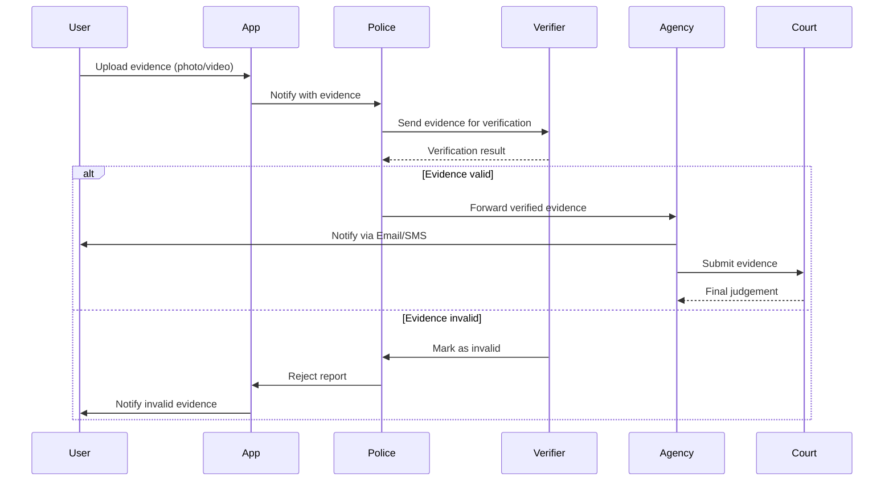

	2025-12-11 20:09

Status:

Tags:

---
# 2021

---

## SECTION A

---

### Q1. Why is modelling required? How UML helps in modelling? (2×2)

#### Why modelling is required

1. It simplifies complex real-world systems by representing them using diagrams.
    
2. Helps understand, analyze, design, and communicate system structure & behavior.
    
3. Reduces ambiguity in requirements.
    
4. Enables early error detection.
    

#### How UML helps

1. UML provides standardized diagrams (class, sequence, use case, etc.).
    
2. Helps visualize system architecture from multiple views.
    
3. Ensures common understanding between developers, clients, analysts.
    
4. Supports documentation and system maintenance.
    

---

### Q2. Define the following terms (4×1)

#### i. Do Activity

- An ongoing action performed while an object is in a particular **state** in a state machine.
    
- It continues until an event interrupts or the state changes.
    

#### ii. Association Class

- A class attached to an association (relationship) to store additional attributes (e.g., _Enrollment_ between _Student_ and _Course_ storing grades).
    

#### iii. Extend Relationship

- Use case relationship where an additional optional behavior **extends** a base use case.
    
- Triggered under certain conditions.
    
- Example: _“Apply Discount” extends “Make Payment”_.
    

#### iv. Collaborators

- Objects/classes that work together to perform a task or realize a use case.
    
- Represented in sequence, collaboration, and CRC models.
    

---

### Q3. Types of requirements in Requirement Engineering (4)

1. **Functional Requirements**  
    – What the system should do (features, services).
    
2. **Non-Functional Requirements**  
    – Performance, reliability, security, usability, availability.
    
3. **User Requirements**  
    – High-level descriptions expected by users.
    
4. **System Requirements**  
    – Detailed, structured specifications for developers.
    
5. **Interface Requirements**  
    – Interaction requirements with hardware, software, and users.
    

---

### Q4. Categorize relationships (4×1)

a) **Mobile is Windows Mobile or Android.**  
✔ _Generalization_  
Justification: Windows and Android are types of Mobile.

b) **Bluetooth connects laptops and Tab.**  
✔ _Association_  
Justification: Simple connection relationship; neither is part of the other.

c) **Processor and RAM are parts of a computer.**  
✔ _Composition_  
Justification: Computer cannot function without them; strong “part-of” relationship.

d) **A browser window has multiple tab windows.**  
✔ _Aggregation_  
Justification: Tabs can exist independently; browser contains them weakly.

---

### Q5. Nodes vs Components + examples (2×2)

#### Nodes

- Physical resources where components execute.
    
- Examples:
    
    1. Application Server
        
    2. Database Server
        

#### Components

- Modular, deployable units of software.
    
- Examples:
    
    1. Login Module
        
    2. Payment Module
        

---

## SECTION B

---

### Q6. Deployment Diagram — College Library Management System (10)

![[Pasted image 20251211202401.png||500]]

---

### Q7. Use Case Diagram — Online Job Portal (10)

![[Pasted image 20251211203139.png]]

---

### Q8. Sequence Diagram — Crime Reporting App (10)



---

### Q9. Activity Diagram OR Swimlane — Codetantra Online Exam (10)


---

## SECTION C

---

### Q10(a) Class Diagram — News Agency (UttrakhandNow) (10)

Classes:

- **NewsAgency**
    
- **Editor**
    
- **Journalist**
    
- **Reporter**
    
- **NewsArticle**
    
- **Category (Sports/Politics/etc.)**
    

Relationships:

- Editor _reviews_ NewsArticle
    
- Reporter _creates_ NewsArticle
    
- Journalist _submits_ NewsArticle
    
- NewsAgency _manages_ all
    

---

### Q10(b) Object Diagram of Given Graph (10)

Based on the diagram in the paper (page 2) :

Objects:

```
v1: Vertex
v2: Vertex
v3: Vertex

e1: Edge (between v1, v2)
e2: Edge (between v2, v3)
e3: Edge (between v1, v3)
```

Show the links visually.

---

### Q11(a) Types of Events in State Diagram (10)

1. **Signal Event**  
    – Triggered by external signal or message.
    
2. **Call Event**  
    – Triggered by an operation call.
    
3. **Time Event**  
    – Triggered by passage of time (after 5 sec).
    
4. **Change Event**  
    – Triggered when a condition becomes true.
    

---

### Q11(b) State Diagram — Train Ticket (Indian Railways) (10)

States:

- Idle
    
- Enter Passenger Details
    
- Select Train
    
- Payment
    
- Ticket Confirmed
    
- Ticket Cancelled
    

Transitions triggered by:

- submitDetails
    
- chooseTrain
    
- pay
    
- confirm
    
- cancel
    

---

### OR Option

### **(a) Aggregation Concurrency**

- When multiple sub-states execute in parallel inside a composite state.
    

### **(a) Nested State Diagram**

- A state containing inner substates.
    

### **(b) State Diagram — Bank Account**

States:

- Active
    
- Depositing
    
- Withdrawing
    
- Overdrawn
    
- Closed
    

---
# Reference
