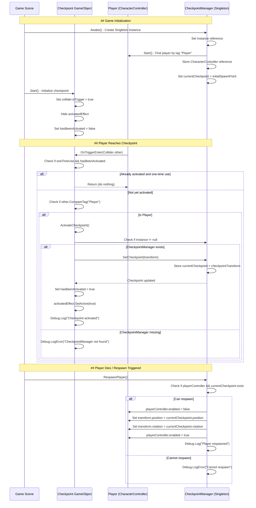
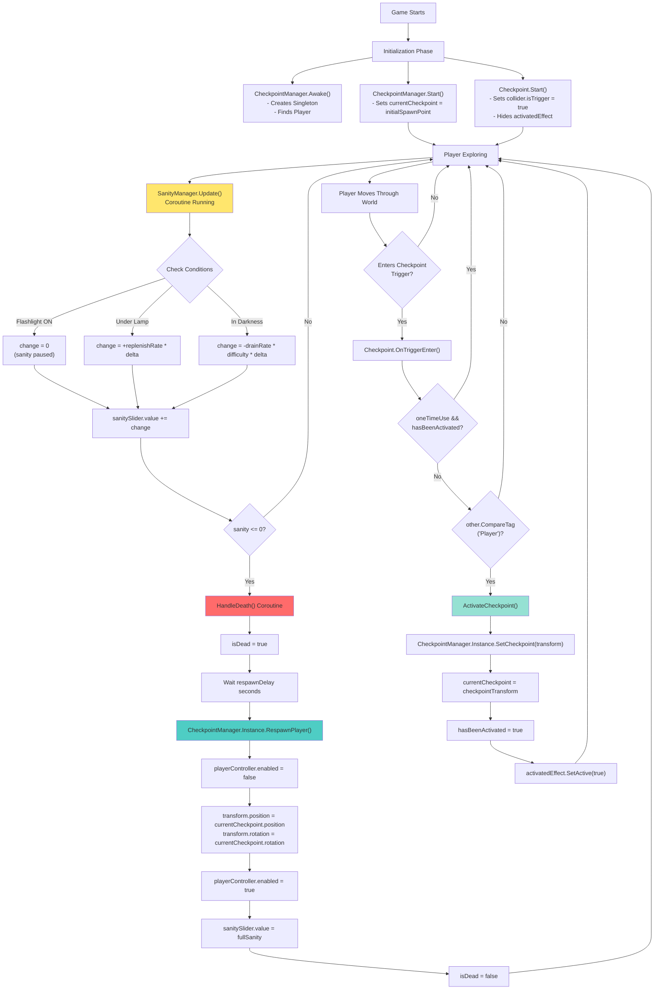

	2025-11-29 17:55

Status:

Tags:

---
# Checkpoint Mechanics

How the Checkpoint System Works
The checkpoint system uses a Singleton pattern with two main components working together:
Components Overview
1.	Checkpoint (attached to checkpoint objects in scene)
•	Detects when the player enters the checkpoint zone
•	Notifies the CheckpointManager
•	Provides visual feedback
2.	CheckpointManager (singleton, one instance in scene)
•	Stores the current active checkpoint
•	Handles player respawning
•	Manages initial spawn point

---



# Detailed Variable Flow

## Checkpoint.cs Variables

| Variable         | Type       | Purpose                 | Flow                                                  |
| ---------------- | ---------- | ----------------------- | ----------------------------------------------------- |
| playerTag        | string     | Tag to identify player  | Set in Inspector → Used in OnTriggerEnter()           |
| activatedEffect  | GameObject | Visual feedback object  | Disabled in Start() → Enabled in ActivateCheckpoint() |
| oneTimeUse       | bool       | Prevent reactivation    | Set in Inspector → Checked in OnTriggerEnter()        |
| hasBeenActivated | bool       | Tracks activation state | false → true when activated                           |

## CheckpointManager.cs Variables

| Variable          | Type                     | Purpose              | Flow                                                        |
| ----------------- | ------------------------ | -------------------- | ----------------------------------------------------------- |
| Instance          | static CheckpointManager | Singleton reference  | Set in Awake() → Accessed by Checkpoint.cs                  |
| initialSpawnPoint | Transform                | First spawn location | Set in Inspector → Assigned to currentCheckpoint in Start() |
| currentCheckpoint | Transform                | Active checkpoint    | Updated by SetCheckpoint() → Used in RespawnPlayer()        |
| playerController  | CharacterController      | Player reference     | Found in Start() → Used to move player in RespawnPlayer()   |

# Key Function Call Chain

## 1. Checkpoint Activation

```
Player enters trigger
    ↓
OnTriggerEnter(Collider other)
    ↓
CompareTag("Player") [checks if collider is player]
    ↓
ActivateCheckpoint()
    ↓
CheckpointManager.Instance.SetCheckpoint(transform) [passes checkpoint's Transform]
    ↓
currentCheckpoint = checkpointTransform [stored in manager]
```

## 2. Player Respawn
```
RespawnPlayer() [called by death system/other script]
    ↓
playerController.enabled = false [required for position change]
    ↓
playerController.transform.position = currentCheckpoint.position
playerController.transform.rotation = currentCheckpoint.rotation
    ↓
playerController.enabled = true [re-enable physics]

```

# Important Design Patterns

1.	Singleton Pattern: Only one CheckpointManager exists, accessible via CheckpointManager.Instance
2.	Observer Pattern: Checkpoints notify the manager when activated
3.	One-time Trigger: hasBeenActivated flag prevents repeated activation (if oneTimeUse = true)

# The Complete Game Loop


#

---
# Reference
