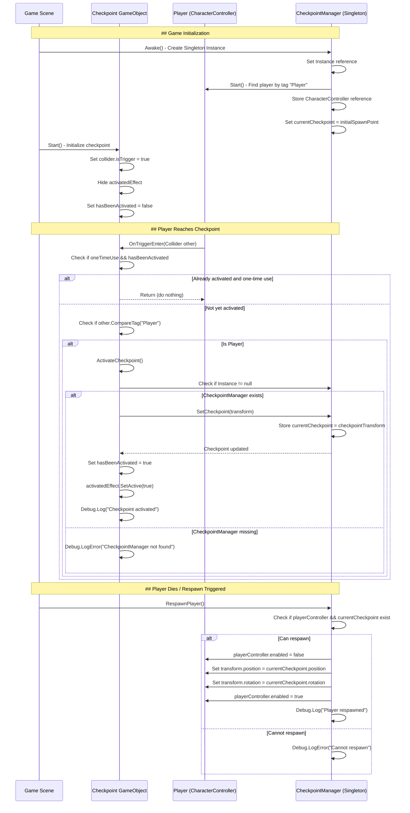

	2025-11-29 17:55

Status:

Tags:

---
# Checkpoint Mechanics

How the Checkpoint System Works
The checkpoint system uses a Singleton pattern with two main components working together:
Components Overview
1.	Checkpoint (attached to checkpoint objects in scene)
•	Detects when the player enters the checkpoint zone
•	Notifies the CheckpointManager
•	Provides visual feedback
2.	CheckpointManager (singleton, one instance in scene)
•	Stores the current active checkpoint
•	Handles player respawning
•	Manages initial spawn point

---

---
# Reference
