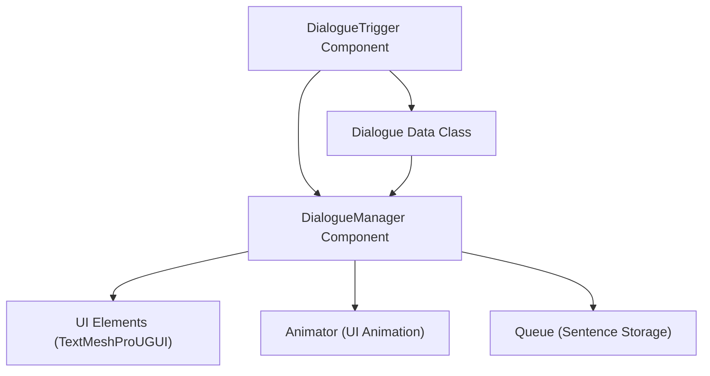
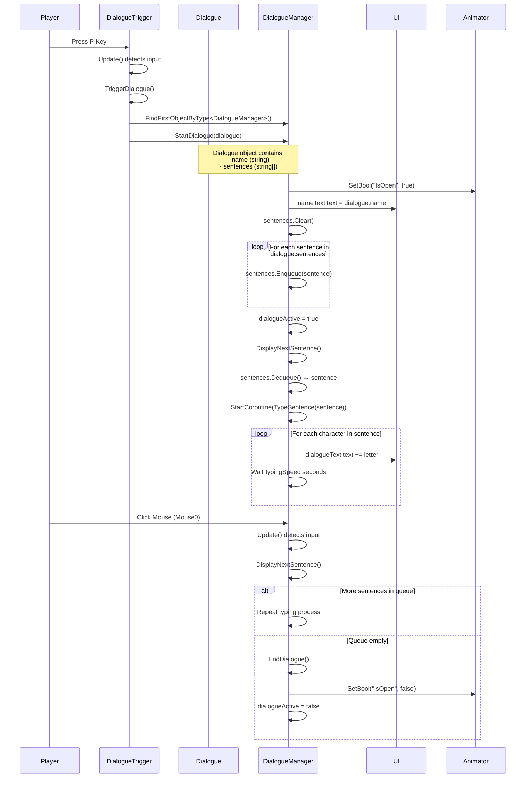

	2025-11-29 22:39

Status:

Tags:

---
# Dialogue Mechanics Flow

## System Architecture

```mermaid
graph TD
    A["DialogueTrigger Component"] --> B["Dialogue Data Class"]
    A --> C["DialogueManager Component"]
    B --> C
    C --> D["UI Elements (TextMeshProUGUI)"]
    C --> E["Animator (UI Animation)"]
    C --> F["Queue<string> (Sentence Storage)"]
```

## Execution Flow

```mermaid
sequenceDiagram
    participant Player
    participant DialogueTrigger
    participant Dialogue
    participant DialogueManager
    participant UI
    participant Animator

    Player->>DialogueTrigger: Press P Key
    DialogueTrigger->>DialogueTrigger: Update() detects input
    DialogueTrigger->>DialogueTrigger: TriggerDialogue()
    DialogueTrigger->>DialogueManager: FindFirstObjectByType<DialogueManager>()
    DialogueTrigger->>DialogueManager: StartDialogue(dialogue)
    
    Note over DialogueManager,Dialogue: Dialogue object contains:<br/>- name (string)<br/>- sentences (string[])
    
    DialogueManager->>Animator: SetBool("IsOpen", true)
    DialogueManager->>UI: nameText.text = dialogue.name
    DialogueManager->>DialogueManager: sentences.Clear()
    
    loop For each sentence in dialogue.sentences
        DialogueManager->>DialogueManager: sentences.Enqueue(sentence)
    end
    
    DialogueManager->>DialogueManager: dialogueActive = true
    DialogueManager->>DialogueManager: DisplayNextSentence()
    DialogueManager->>DialogueManager: sentences.Dequeue() → sentence
    DialogueManager->>DialogueManager: StartCoroutine(TypeSentence(sentence))
    
    loop For each character in sentence
        DialogueManager->>UI: dialogueText.text += letter
        DialogueManager->>DialogueManager: Wait typingSpeed seconds
    end
    
    Player->>DialogueManager: Click Mouse (Mouse0)
    DialogueManager->>DialogueManager: Update() detects input
    DialogueManager->>DialogueManager: DisplayNextSentence()
    
    alt More sentences in queue
        DialogueManager->>DialogueManager: Repeat typing process
    else Queue empty
        DialogueManager->>DialogueManager: EndDialogue()
        DialogueManager->>Animator: SetBool("IsOpen", false)
        DialogueManager->>DialogueManager: dialogueActive = false
    end
```

## Detailed Variable Flow

### 1. DialogueTrigger.cs

---
# Reference
