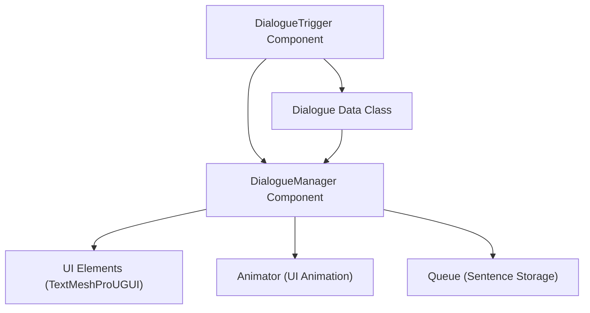
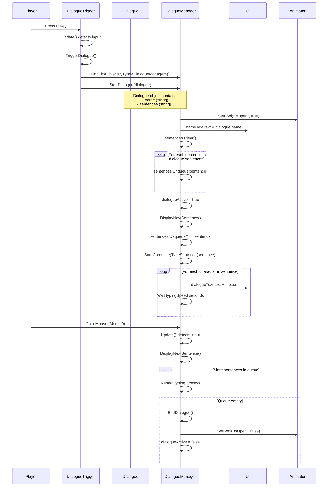

	2025-11-29 22:39

Status:

Tags:

---
# Dialogue Mechanics Flow

## System Architecture



## Execution Flow


## Detailed Variable Flow

### 1. DialogueTrigger.cs

```
// Component attached to GameObject
public Dialogue dialogue; // Assigned in Unity Inspector
```
•	**Input: KeyCode.P** pressed
•	**Action:** Calls **TriggerDialogue()**
•	**Passes:** dialogue object → **DialogueManager.StartDialogue(dialogue)**

### 2. Dialogue.cs (Data Container)

```
[System.Serializable]
public class Dialogue
{
    public string name;           // Character name displayed
    public string[] sentences;    // Array of dialogue lines
}

```
```
•	Variables Passed:
•	name → DialogueManager.nameText.text
•	sentences[] → Enqueued into Queue<string>
```

### 3. DialogueManager.cs (Core Logic)

```
Key Variables:
•	Queue<string> sentences - FIFO queue holding dialogue lines
•	bool dialogueActive - Tracks if dialogue is currently running
•	float typingSpeed - Delay between characters (default: 0.05s)
```

## Function Call Chain:

### StartDialogue(Dialogue dialogue)

Receives: Dialogue object with name and sentences[]
Processing:
1.	animator.SetBool("IsOpen", true) - Opens dialogue box UI
2.	nameText.text = dialogue.name - Sets character name
3.	sentences.Clear() - Empties previous dialogue
4.	Loop: foreach (string sentence in dialogue.sentences)
•	sentences.Enqueue(sentence) - Adds each sentence to queue
5.	dialogueActive = true - Enables input detection
6.	Calls DisplayNextSentence()

### DisplayNextSentence()

Processing:
1.	Check: if (sentences.Count == 0) → EndDialogue()
2.	string sentence = sentences.Dequeue() - Gets next line (removes from queue)
3.	StopAllCoroutines() - Cancels any ongoing typing
4.	StartCoroutine(TypeSentence(sentence)) - Begins typing effect
Passes: sentence (string) → TypeSentence()

### TypeSentence(string sentence)

Receives: Single sentence string
Processing:
1.	dialogueText.text = "" - Clears previous text
2.	Loop: foreach (char letter in sentence.ToCharArray())
•	dialogueText.text += letter - Adds one character
•	yield return new WaitForSeconds(typingSpeed) - Waits 0.05s
3.	Coroutine completes when all characters displayed

### EndDialogue()

Processing:
1.	dialogueActive = false - Disables input
2.	animator.SetBool("IsOpen", false) - Closes dialogue box

## Input Handling (for now)

**Trigger Input**
•	Key: KeyCode.P (in DialogueTrigger.Update())
•	Action: Initiates dialogue sequence

**Advance Input**
•	Key: KeyCode.Mouse0 (Left Mouse Button) in DialogueManager.Update()
•	Condition: Only works when dialogueActive == true
•	Action: Advances to next sentence

## 

---
# Reference
