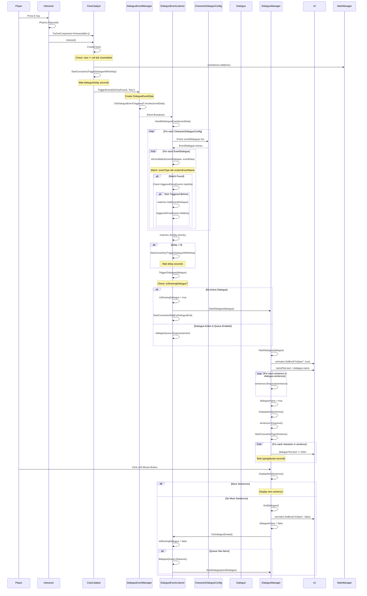

	2025-11-30 17:57

Status:

Tags:

---
# Updated DialogueSys

## System Architecture Overview
```
┌─────────────────────────────────────────────────────────────────┐
│                     DIALOGUE SYSTEM FLOW                         │
└─────────────────────────────────────────────────────────────────┘

Trigger Sources:
├─ ClueCatalyst (clue collection)
├─ DialogueAreaTrigger (area entry/exit)
└─ DialogueTrigger (manual/button press)
           ↓
    DialogueEventManager (event broadcasting)
           ↓
    DialogueEventListener (event matching & routing)
           ↓
    DialogueManager (UI display & text animation)
```

## Complete Flow Diagram



## Flow Breakdown

### Phase 1: Trigger Initiation

#### Option A: Clue Collection via ClueCatalyst

```
// 1. Player presses E near clue object
Input.GetKeyDown(KeyCode.E) // in Interactor.Update()

// 2. Interactor raycasts forward
Ray r = new Ray(InteractorSource.position, InteractorSource.forward);
Physics.Raycast(r, out RaycastHit hitInfo, InteractorRange)

// 3. Checks for IInteractable component
hitInfo.collider.gameObject.TryGetComponent(out IInteractable interactObj)

// 4. Calls Interact() method
interactObj.Interact() // → ClueCatalyst.Interact()
```

**Variables Passed:**
•	InteractorSource.position: Vector3 (camera position)
•	InteractorSource.forward: Vector3 (camera forward direction)
•	InteractorRange: float (raycast distance, e.g., 3.0f)
•	hitInfo: RaycastHit (collision data)
•	interactObj: IInteractable (the ClueCatalyst instance)

```
// 5. ClueCatalyst.Interact() → CreateClue()
public void Interact()
{
    CreateClue();
}

// 6. CreateClue() executes
public void CreateClue()
{
    // Validation
    if (clue != null && !clueAdded)
    {
        clueAdded = true;
        MainManager.mainManager.clueNames.Add(clue);
        
        // Determine event name
        string eventName = string.IsNullOrEmpty(customDialogueEventName) 
            ? clue 
            : customDialogueEventName;
        
        // Trigger with delay
        if (dialogueDelay > 0)
        {
            StartCoroutine(TriggerDialogueWithDelay(eventName));
        }
        else
        {
            DialogueEventManager.Instance.TriggerEvent(
                DialogueEventType.OnClueFound, 
                eventName
            );
        }
    }
}
```

**Variables at this point:**
•	clue: string (e.g., "Key")
•	clueAdded: bool (false → true)
•	customDialogueEventName: string (empty or custom name)
•	eventName: string (resolved to "Key")
•	dialogueDelay: float (e.g., 0.5f)

#### Option B: Area Trigger via DialogueAreaTrigger

```
// 1. Player enters trigger collider
void OnTriggerEnter(Collider other)
{
    if (!ShouldTrigger(other)) return;
    
    if (triggerMode == TriggerMode.OnEnter || triggerMode == TriggerMode.Both)
    {
        TriggerDialogueEvent();
    }
}

// 2. Validation check
private bool ShouldTrigger(Collider other)
{
    // Check player tag
    if (!other.CompareTag(playerTag)) // "Player"
        return false;
    
    // Check trigger-once logic
    if (triggerOnce && hasTriggered)
        return false;
    
    return true;
}

// 3. Trigger event
private void TriggerDialogueEvent()
{
    if (triggerOnce)
    {
        hasTriggered = true;
    }
    
    if (dialogueDelay > 0)
    {
        StartCoroutine(TriggerWithDelay());
    }
    else
    {
        TriggerEvent();
    }
}

// 4. Call event manager
private void TriggerEvent()
{
    DialogueEventManager.Instance.TriggerEvent(eventType, eventName);
}
```

**Variables Passed:**
•	other: Collider (player's collider)
•	playerTag: string ("Player")
•	eventType: DialogueEventType (e.g., Custom)
•	eventName: string (e.g., "EntranceArea")
•	dialogueDelay: float (e.g., 0.5f)
•	triggerOnce: bool
•	hasTriggered: bool (false → true)

### Phase 2: Event Broadcasting

```
// DialogueEventManager.TriggerEvent()
public void TriggerEvent(
    DialogueEventType eventType,  // OnClueFound or Custom
    string customName = "",        // "Key" or "EntranceArea"
    object data = null             // Optional additional data
)
{
    // 1. Create event data wrapper
    var eventData = new DialogueEventData(eventType, customName, data);
    
    // 2. Log if debug enabled
    if (enableDebugLogs)
    {
        Debug.Log($"[DialogueEventManager] Triggering event: {eventType} (Custom: {customName})");
    }
    
    // 3. Broadcast to all listeners
    OnDialogueEventTriggered?.Invoke(eventData);
}
```

#### DialogueEventData Structure:

```
public class DialogueEventData
{
    public DialogueEventType eventType;    // OnClueFound, Custom, etc.
    public string customEventName;         // "Key", "EntranceArea"
    public object additionalData;          // Optional extra data
}

```

##### Example Event Data:

```
// For clue collection:
eventData = {
    eventType: DialogueEventType.OnClueFound,
    customEventName: "Key",
    additionalData: null
}

// For area trigger:
eventData = {
    eventType: DialogueEventType.Custom,
    customEventName: "EntranceArea",
    additionalData: null
}
```

### Phase 3: Event Listening & Matching

```
// DialogueEventListener.HandleDialogueEvent()
private void HandleDialogueEvent(DialogueEventData eventData)
{
    Debug.Log($"[DialogueEventListener] Received event: {eventData.eventType} (Custom: '{eventData.customEventName}')");
    
    // 1. Initialize matches list
    List<CharacterDialogueConfig.EventDialogue> matches = new List<CharacterDialogueConfig.EventDialogue>();
    
    // 2. Search through all character configs
    foreach (var config in characterConfigs) // e.g., PlayerClueDialogues
    {
        if (config == null) continue;
        
        // 3. Check each event dialogue in the config
        foreach (var eventDialogue in config.eventDialogues)
        {
            // 4. Match check
            if (IsEventMatch(eventDialogue, eventData))
            {
                Debug.Log($"[DialogueEventListener] Found match in config '{config.characterName}'!");
                
                // 5. Check trigger-once logic
                string key = $"{config.characterName}_{eventData.eventType}_{eventDialogue.customEventName}";
                // Example key: "Player_OnClueFound_Key"
                
                if (eventDialogue.triggerOnce && triggeredOnceEvents.Contains(key))
                {
                    Debug.Log($"[DialogueEventListener] Skipping - already triggered once");
                    continue;
                }
                
                // 6. Add to matches
                matches.Add(eventDialogue);
                
                // 7. Mark as triggered
                if (eventDialogue.triggerOnce)
                {
                    triggeredOnceEvents.Add(key);
                }
            }
        }
    }
    
    Debug.Log($"[DialogueEventListener] Total matches found: {matches.Count}");
    
    // 8. Handle no matches
    if (matches.Count == 0)
    {
        Debug.LogWarning($"[DialogueEventListener] No matching dialogue found");
        return;
    }
    
    // 9. Sort by priority (highest first)
    matches.Sort((a, b) => b.priority.CompareTo(a.priority));
    
    // 10. Trigger all matches
    foreach (var match in matches)
    {
        if (match.dialogue == null)
        {
            Debug.LogError("[DialogueEventListener] Dialogue reference is null!");
            continue;
        }
        
        if (match.delay > 0)
        {
            StartCoroutine(TriggerDialogueWithDelay(match.dialogue, match.delay));
        }
        else
        {
            TriggerDialogue(match.dialogue);
        }
    }
}
```

#### Matching Logic:

```
private bool IsEventMatch(
    CharacterDialogueConfig.EventDialogue eventDialogue,
    DialogueEventData eventData
)
{
    // 1. Check event type
    if (eventDialogue.eventType != eventData.eventType)
    {
        Debug.Log($"Event type mismatch: {eventDialogue.eventType} != {eventData.eventType}");
        return false;
    }
    
    // 2. Check custom name (for Custom events or events with names)
    if (eventData.eventType == DialogueEventType.Custom || 
        !string.IsNullOrEmpty(eventData.customEventName))
    {
        bool match = eventDialogue.customEventName == eventData.customEventName;
        if (!match)
        {
            Debug.Log($"Custom name mismatch: '{eventDialogue.customEventName}' != '{eventData.customEventName}'");
        }
        return match;
    }
    
    // 3. Default match
    return true;
}
```

##### Example Matching:

```
Event Data:
  eventType: Custom
  customEventName: "EntranceArea"

Config Entry:
  eventType: Custom
  customEventName: "EntranceArea"
  dialogue: EntranceAreaDialogue

Result: MATCH ✅
```

###### Data Structures at this Point:

```
characterConfigs = List<CharacterDialogueConfig> {
    PlayerClueDialogues {
        characterName: "Player",
        eventDialogues: List<EventDialogue> {
            EventDialogue {
                eventType: OnClueFound,
                customEventName: "Key",
                dialogue: KeyDialogue,
                triggerOnce: true,
                delay: 0.5f,
                priority: 0
            },
            EventDialogue {
                eventType: Custom,
                customEventName: "EntranceArea",
                dialogue: EntranceDialogue,
                triggerOnce: true,
                delay: 0.5f,
                priority: 0
            }
        }
    }
}

matches = List<EventDialogue> {
    EventDialogue { /* matching dialogue */ }
}

triggeredOnceEvents = HashSet<string> {
    "Player_Custom_EntranceArea"
}
```

### Phase 4: Dialogue Triggering

```
// DialogueEventListener.TriggerDialogue()
private void TriggerDialogue(Dialogue dialogue)
{
    // 1. Validation
    if (dialogueManager == null)
    {
        Debug.LogError("[DialogueEventListener] DialogueManager reference is missing!");
        return;
    }
    
    if (dialogue == null)
    {
        Debug.LogError("[DialogueEventListener] Dialogue is null!");
        return;
    }
    
    Debug.Log($"[DialogueEventListener] Triggering dialogue: {dialogue.name}");
    
    // 2. Check if dialogue is already active
    if (queueDialogues && isShowingDialogue && !allowInterruption)
    {
        // Queue for later
        Debug.Log("[DialogueEventListener] Dialogue already active - queueing");
        dialogueQueue.Enqueue(() => dialogueManager.StartDialogue(dialogue));
    }
    else
    {
        // 3. Show immediately
        if (allowInterruption)
        {
            StopAllCoroutines();
        }
        
        isShowingDialogue = true;
        dialogueManager.StartDialogue(dialogue); // → DialogueManager
        StartCoroutine(WaitForDialogueEnd());
    }
}
```

**Variables:**
•	dialogue: Dialogue asset reference
```
Dialogue {
      name: "Player",
      sentences: string[] {
          "Found the key.",
          "I wonder what this unlocks...",
          "Better keep this safe."
      }
  }

```
```
•	queueDialogues: bool (true = queue if busy)
•	isShowingDialogue: bool (tracks active state)
•	allowInterruption: bool (false = don't interrupt)
•	dialogueQueue: Queue<Action> (pending dialogues)
```

### Phase 5: Dialogue Display

```
// DialogueManager.StartDialogue()
public void StartDialogue(Dialogue dialogue)
{
    // 1. Show dialogue box
    animator.SetBool("IsOpen", true);
    
    // 2. Set speaker name
    nameText.text = dialogue.name; // "Player"
    
    // 3. Clear previous sentences
    sentences.Clear();
    
    // 4. Validation
    if (dialogue.sentences == null || dialogue.sentences.Length == 0)
    {
        Debug.LogError("No sentences found in dialogue!");
        return;
    }
    
    Debug.Log("Number of sentences: " + dialogue.sentences.Length);
    
    // 5. Enqueue all sentences
    foreach (string sentence in dialogue.sentences)
    {
        sentences.Enqueue(sentence);
    }
    // sentences queue now contains: ["Found the key.", "I wonder...", "Better keep..."]
    
    // 6. Activate dialogue
    dialogueActive = true;
    
    // 7. Display first sentence
    DisplayNextSentence();
}
```

UI Components:
•	animator: Animator (controls dialogue box animation)
	•	Parameter: IsOpen (bool)
	•	Animation: DialogueBoxOpen/Close
•	nameText: TextMeshProUGUI (displays speaker name)
	•	Text: "Player"
•	dialogueText: TextMeshProUGUI (displays sentence)
	•	Text: Initially empty, fills with typing effect

```
// DialogueManager.DisplayNextSentence()
public void DisplayNextSentence()
{
    // 1. Check if more sentences
    if (sentences.Count == 0)
    {
        EndDialogue();
        return;
    }
    
    // 2. Get next sentence
    string sentence = sentences.Dequeue(); // "Found the key."
    
    // 3. Stop previous typing
    StopAllCoroutines();
    
    // 4. Start new typing effect
    StartCoroutine(TypeSentence(sentence));
}

```

### Phase 6: Typing Animation

```
// DialogueManager.TypeSentence()
IEnumerator TypeSentence(string sentence)
{
    // 1. Clear text
    dialogueText.text = "";
    
    // 2. Type each character
    foreach (char letter in sentence.ToCharArray())
    {
        dialogueText.text += letter;
        yield return new WaitForSeconds(typingSpeed); // 0.05f default
    }
    
    // After completion, text shows: "Found the key."
}

```

#### Timeline Example:
```
T+0.00s: dialogueText = ""
T+0.05s: dialogueText = "F"
T+0.10s: dialogueText = "Fo"
T+0.15s: dialogueText = "Fou"
T+0.20s: dialogueText = "Foun"
...
T+0.75s: dialogueText = "Found the key."
```

**Variables:**
•	sentence: string ("Found the key.")
•	typingSpeed: float (0.05f = 50ms per character)
•	Total time = sentence.Length × typingSpeed

### Phase 7: Player Advancement

```
// DialogueManager.Update()
void Update()
{
    // Check for player input
    if (dialogueActive && Input.GetKeyDown(KeyCode.Mouse0))
    {
        DisplayNextSentence();
    }
}
```

**Flow:**
1.	Player clicks left mouse button
2.	Calls DisplayNextSentence()
3.	Dequeues next sentence from queue
4.	If queue empty → EndDialogue()

### Phase 8: Dialogue Completion

```
// DialogueManager.EndDialogue()
void EndDialogue()
{
    Debug.Log("End of conversation.");
    
    // 1. Mark dialogue as inactive
    dialogueActive = false;
    
    // 2. Hide dialogue box
    animator.SetBool("IsOpen", false);
    
    // 3. Notify listener
    DialogueEventListener listener = FindFirstObjectByType<DialogueEventListener>();
    if (listener != null)
    {
        listener.OnDialogueEnded();
    }
}
```

```
// DialogueEventListener.OnDialogueEnded()
public void OnDialogueEnded()
{
    // 1. Mark as not showing
    isShowingDialogue = false;
    
    // 2. Check queue
    if (dialogueQueue.Count > 0)
    {
        // 3. Trigger next queued dialogue
        var nextDialogue = dialogueQueue.Dequeue();
        nextDialogue?.Invoke(); // → dialogueManager.StartDialogue(nextDialogue)
    }
}
```

## Complete Variable Tracking

### From Trigger to Display:

```
1. ClueCatalyst Fields:
   - clue: "Key"
   - customDialogueEventName: ""
   - dialogueDelay: 0.5f
   - clueAdded: false → true

2. Resolved Event Name:
   - eventName: "Key" (from clue, since customDialogueEventName is empty)

3. DialogueEventData:
   - eventType: DialogueEventType.OnClueFound
   - customEventName: "Key"
   - additionalData: null

4. CharacterDialogueConfig Matching:
   - config.characterName: "Player"
   - eventDialogue.eventType: OnClueFound
   - eventDialogue.customEventName: "Key"
   - eventDialogue.dialogue: KeyDialogue asset
   - eventDialogue.triggerOnce: true
   - eventDialogue.delay: 0.5f
   - eventDialogue.priority: 0

5. Trigger Once Key:
   - key: "Player_OnClueFound_Key"
   - Added to: triggeredOnceEvents HashSet

6. Dialogue Asset (KeyDialogue):
   - name: "Player"
   - sentences: ["Found the key.", "I wonder what this unlocks...", "Better keep this safe."]

7. DialogueManager State:
   - dialogueActive: false → true → false
   - sentences Queue:
     Initial: ["Found the key.", "I wonder...", "Better keep..."]
     After 1st click: ["I wonder...", "Better keep..."]
     After 2nd click: ["Better keep..."]
     After 3rd click: []
   - nameText: "Player"
   - dialogueText: Typed character by character

8. DialogueEventListener State:
   - isShowingDialogue: false → true → false
   - dialogueQueue: Empty (or contains queued dialogues)
   - triggeredOnceEvents: Contains "Player_OnClueFound_Key"
```

## Complete Example Flow

```
Frame 1: Player presses E
└─ Interactor.Update() detects Input.GetKeyDown(KeyCode.E)
   └─ Physics.Raycast(camera.position, camera.forward, 3.0f)
      └─ Hits: Key GameObject
         └─ TryGetComponent<IInteractable>() → ClueCatalyst
            └─ ClueCatalyst.Interact()

Frame 1: ClueCatalyst.Interact()
└─ ClueCatalyst.CreateClue()
   ├─ Check: clue="Key", clueAdded=false ✅
   ├─ clueAdded = true
   ├─ MainManager.clueNames.Add("Key")
   ├─ eventName = "Key" (clue is used)
   └─ StartCoroutine(TriggerDialogueWithDelay("Key"))

Frames 1-30: Wait 0.5 seconds (30 frames at 60 FPS)

Frame 30: TriggerDialogueWithDelay continues
└─ DialogueEventManager.Instance.TriggerEvent(OnClueFound, "Key")
   ├─ Create eventData: { OnClueFound, "Key", null }
   ├─ Log: "[DialogueEventManager] Triggering event: OnClueFound (Custom: Key)"
   └─ OnDialogueEventTriggered?.Invoke(eventData)

Frame 30: Event broadcast received
└─ DialogueEventListener.HandleDialogueEvent(eventData)
   ├─ Log: "[DialogueEventListener] Received event: OnClueFound (Custom: 'Key')"
   ├─ Loop through characterConfigs
   │  └─ PlayerClueDialogues config
   │     └─ Loop through eventDialogues
   │        └─ EventDialogue: {OnClueFound, "Key", KeyDialogue, ...}
   │           └─ IsEventMatch() → TRUE ✅
   │              ├─ Log: "[DialogueEventListener] Found match in config 'Player'!"
   │              ├─ Check triggeredOnceEvents for "Player_OnClueFound_Key" → NOT FOUND
   │              ├─ Add to matches list
   │              └─ triggeredOnceEvents.Add("Player_OnClueFound_Key")
   ├─ Log: "[DialogueEventListener] Total matches found: 1"
   ├─ matches.Sort(by priority)
   ├─ match.delay = 0.5f > 0
   └─ StartCoroutine(TriggerDialogueWithDelay(KeyDialogue, 0.5f))

Frames 30-60: Wait 0.5 seconds

Frame 60: TriggerDialogueWithDelay continues
└─ DialogueEventListener.TriggerDialogue(KeyDialogue)
   ├─ Check: dialogueManager != null ✅
   ├─ Check: dialogue != null ✅
   ├─ Log: "[DialogueEventListener] Triggering dialogue: Player"
   ├─ Check: isShowingDialogue = false ✅
   ├─ isShowingDialogue = true
   ├─ DialogueManager.StartDialogue(KeyDialogue)
   └─ StartCoroutine(WaitForDialogueEnd())

Frame 60: DialogueManager.StartDialogue(KeyDialogue)
├─ animator.SetBool("IsOpen", true)
├─ nameText.text = "Player"
├─ sentences.Clear()
├─ Check: sentences.Length = 3 ✅
├─ Log: "Number of sentences: 3"
├─ sentences.Enqueue("Found the key.")
├─ sentences.Enqueue("I wonder what this unlocks...")
├─ sentences.Enqueue("Better keep this safe.")
├─ dialogueActive = true
└─ DisplayNextSentence()

Frame 60: DialogueManager.DisplayNextSentence()
├─ Check: sentences.Count = 3 > 0 ✅
├─ sentence = sentences.Dequeue() → "Found the key."
├─ StopAllCoroutines()
└─ StartCoroutine(TypeSentence("Found the key."))

Frames 60-75: TypeSentence animation
├─ Frame 60: dialogueText = ""
├─ Frame 61: dialogueText = "F"
├─ Frame 62: dialogueText = "Fo"
├─ Frame 63: dialogueText = "Fou"
├─ ...
└─ Frame 75: dialogueText = "Found the key."

Frame 100: Player clicks left mouse button
└─ DialogueManager.Update() detects Input.GetKeyDown(KeyCode.Mouse0)
   └─ dialogueActive = true ✅
      └─ DisplayNextSentence()
         ├─ sentence = sentences.Dequeue() → "I wonder what this unlocks..."
         └─ StartCoroutine(TypeSentence("I wonder what this unlocks..."))

Frame 150: Player clicks again
└─ DisplayNextSentence()
   ├─ sentence = sentences.Dequeue() → "Better keep this safe."
   └─ StartCoroutine(TypeSentence("Better keep this safe."))

Frame 200: Player clicks again
└─ DisplayNextSentence()
   ├─ Check: sentences.Count = 0
   └─ EndDialogue()
      ├─ Log: "End of conversation."
      ├─ dialogueActive = false
      ├─ animator.SetBool("IsOpen", false)
      └─ DialogueEventListener.OnDialogueEnded()
         ├─ isShowingDialogue = false
         └─ dialogueQueue.Count = 0 (no queued dialogues)
```

---
# Reference
