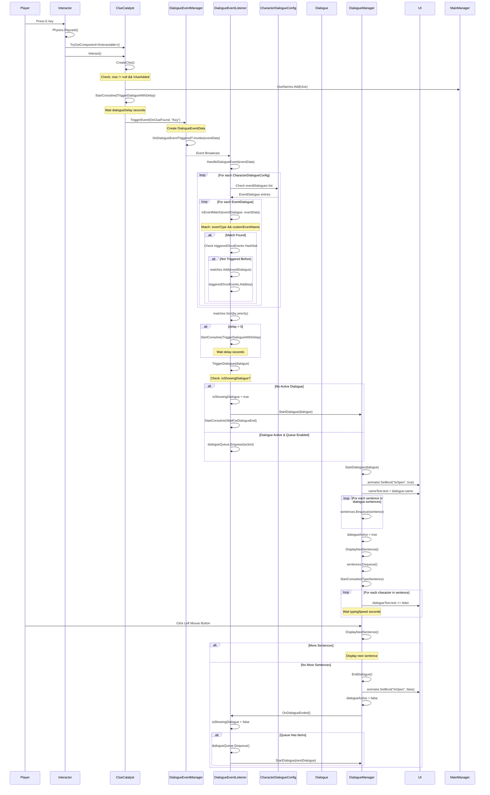

	2025-11-30 17:57

Status:

Tags:

---
# Updated DialogueSys

## System Architecture Overview
```
┌─────────────────────────────────────────────────────────────────┐
│                     DIALOGUE SYSTEM FLOW                         │
└─────────────────────────────────────────────────────────────────┘

Trigger Sources:
├─ ClueCatalyst (clue collection)
├─ DialogueAreaTrigger (area entry/exit)
└─ DialogueTrigger (manual/button press)
           ↓
    DialogueEventManager (event broadcasting)
           ↓
    DialogueEventListener (event matching & routing)
           ↓
    DialogueManager (UI display & text animation)
```

## Complete Flow Diagram



## Flow Breakdown

### Phase 1: Trigger Initiation

#### Option A: Clue Collection via ClueCatalyst

```
// 1. Player presses E near clue object
Input.GetKeyDown(KeyCode.E) // in Interactor.Update()

// 2. Interactor raycasts forward
Ray r = new Ray(InteractorSource.position, InteractorSource.forward);
Physics.Raycast(r, out RaycastHit hitInfo, InteractorRange)

// 3. Checks for IInteractable component
hitInfo.collider.gameObject.TryGetComponent(out IInteractable interactObj)

// 4. Calls Interact() method
interactObj.Interact() // → ClueCatalyst.Interact()
```

**Variables Passed:**
•	InteractorSource.position: Vector3 (camera position)
•	InteractorSource.forward: Vector3 (camera forward direction)
•	InteractorRange: float (raycast distance, e.g., 3.0f)
•	hitInfo: RaycastHit (collision data)
•	interactObj: IInteractable (the ClueCatalyst instance)

---
# Reference
