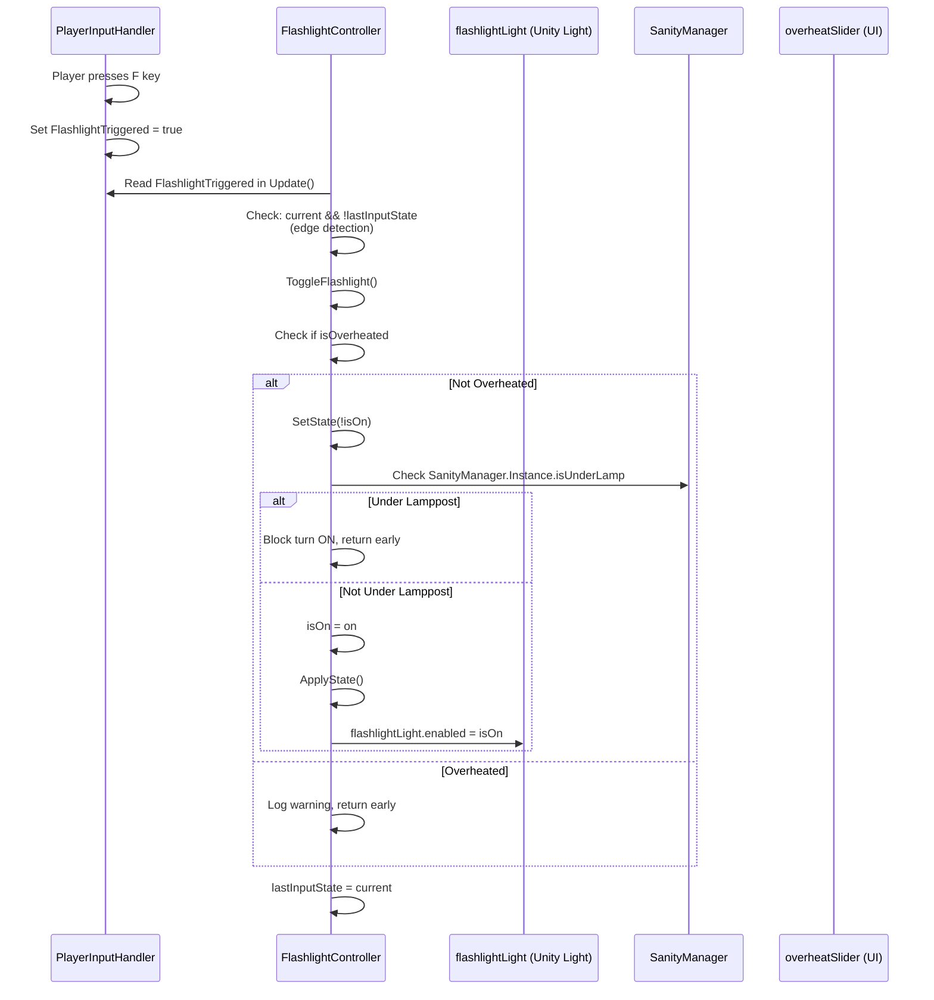

	2025-11-29 21:18

Status:

Tags:

---
# Flashlight Mechanics Flow

```mermaid
sequenceDiagram
    participant Input as PlayerInputHandler
    participant FC as FlashlightController
    participant Light as flashlightLight (Unity Light)
    participant SM as SanityManager
    participant UI as overheatSlider (UI)

    Input->>Input: Player presses F key
    Input->>Input: Set FlashlightTriggered = true
    FC->>Input: Read FlashlightTriggered in Update()
    FC->>FC: Check: current && !lastInputState<br/>(edge detection)
    FC->>FC: ToggleFlashlight()
    FC->>FC: Check if isOverheated
    alt Not Overheated
        FC->>FC: SetState(!isOn)
        FC->>SM: Check SanityManager.Instance.isUnderLamp
        alt Under Lamppost
            FC->>FC: Block turn ON, return early
        else Not Under Lamppost
            FC->>FC: isOn = on
            FC->>FC: ApplyState()
            FC->>Light: flashlightLight.enabled = isOn
        end
    else Overheated
        FC->>FC: Log warning, return early
    end
    FC->>FC: lastInputState = current
```

---
# Reference
