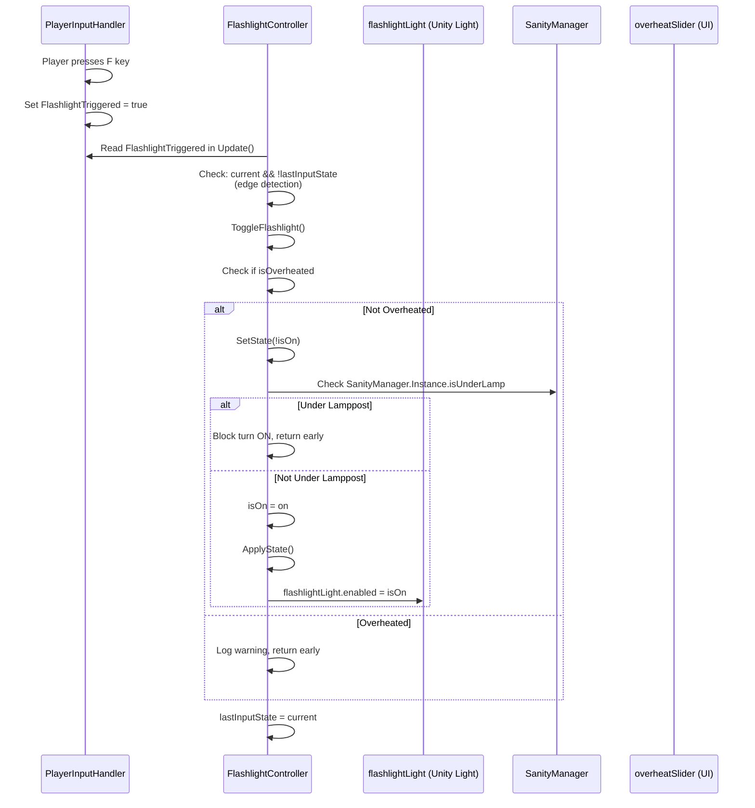
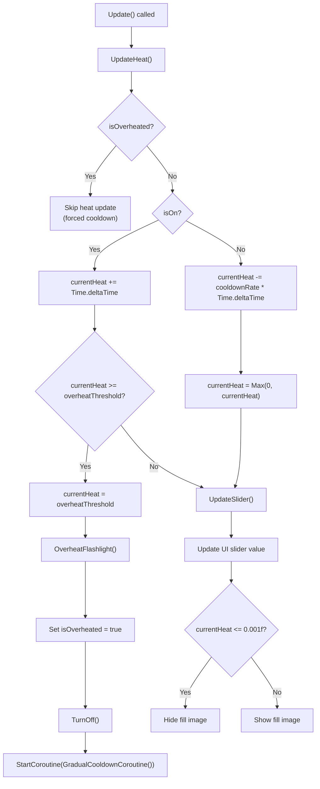

	2025-11-29 21:18

Status:

Tags:

---
# Flashlight Mechanics Flow

## 1. Input Detection Flow

## 2. Overheat System Flow

## Key Variables in Heat System:
| Variable | Type | Purpose | Default | 
|----------|------|---------|---------| 
| currentHeat | float | Current heat accumulation | 0f | 
| overheatThreshold | float | Max heat before overheat | 10f | 
| cooldownRate | float | Heat decrease per second (when OFF) | 2f | 
| overheatCooldownDuration | float | Forced cooldown duration | 5f | 
| isOverheated | bool | Blocks flashlight usage | false |

---
# Reference
