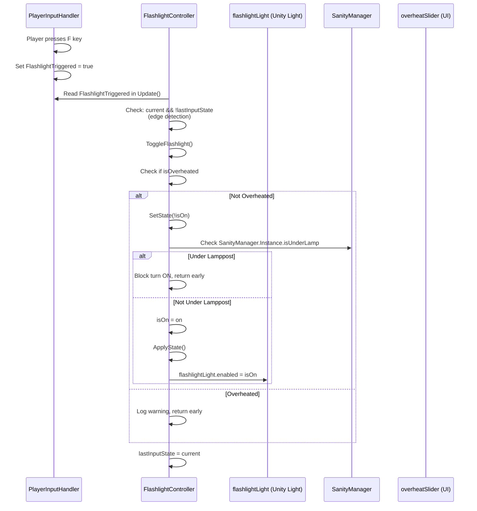
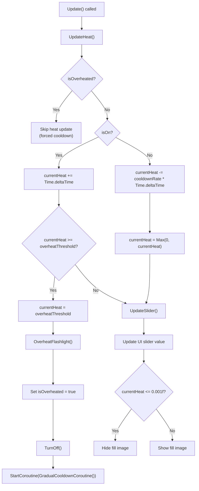
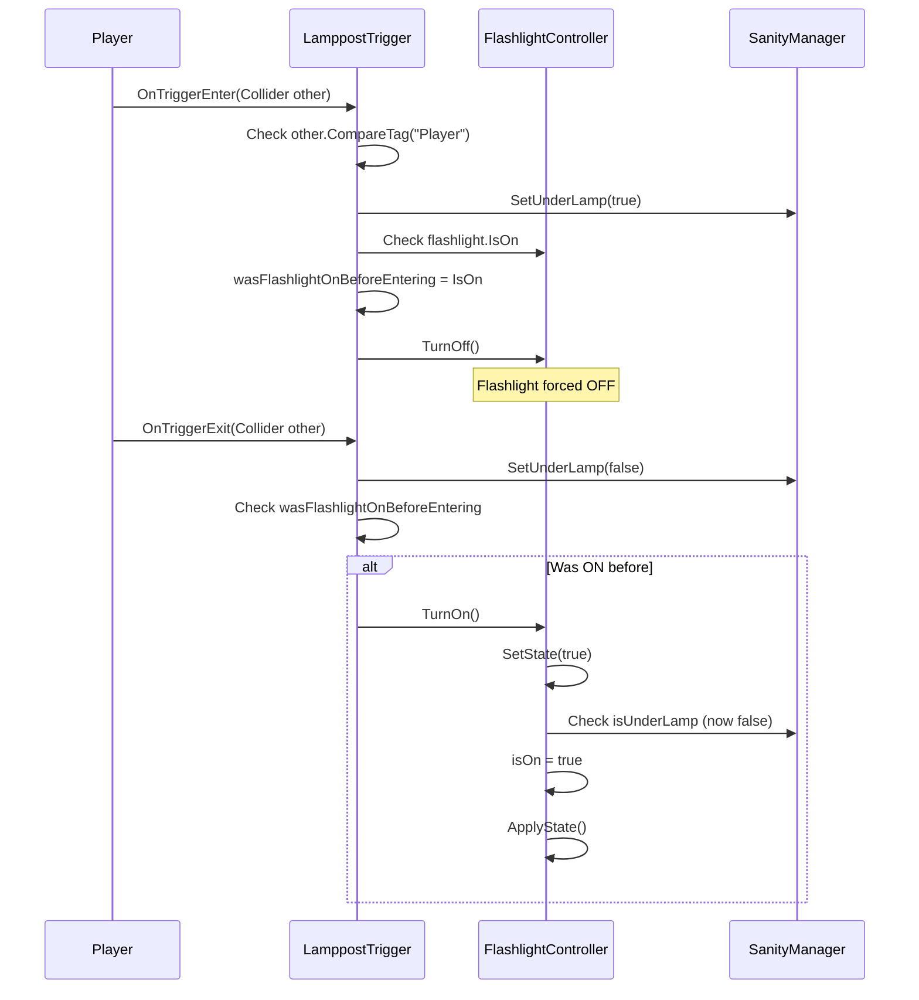

	2025-11-29 21:18

Status:

Tags:

---
# Flashlight Mechanics Flow

## 1. Input Detection Flow



## 2. Overheat System Flow



## Key Variables in Heat System:
| Variable | Type | Purpose | Default | 
|----------|------|---------|---------| 
| currentHeat | float | Current heat accumulation | 0f | 
| overheatThreshold | float | Max heat before overheat | 10f | 
| cooldownRate | float | Heat decrease per second (when OFF) | 2f | 
| overheatCooldownDuration | float | Forced cooldown duration | 5f | 
| isOverheated | bool | Blocks flashlight usage | false |

## 3. Overheat Coroutine Flow
```
GradualCooldownCoroutine() Flow:
├─ Calculate cooldownSpeed = overheatThreshold / overheatCooldownDuration
│  └─ Example: 10f / 5f = 2f per second
├─ While (currentHeat > 0f):
│  ├─ currentHeat -= cooldownSpeed * Time.deltaTime
│  ├─ currentHeat = Max(0f, currentHeat)
│  └─ yield return null (wait 1 frame)
├─ Ensure currentHeat = 0f
└─ Set isOverheated = false
```
**Variables Passed:**
•	Uses class fields: currentHeat, overheatThreshold, overheatCooldownDuration
•	Updates UI through UpdateSlider() in Update() loop

## 4. Lamppost Interaction Flow


**Key Variables:**
•	wasFlashlightOnBeforeEntering (bool): Stores flashlight state before entering lamppost area
•	playerTag (string): Tag to identify player ("Player")

## 5. Sanity System Integration
```
// In SanityManager.UpdateSanityCoroutine()

bool flashlightOn = flashlightController.IsOn;  // ← Read from FlashlightController
bool underLamp = isUnderLamp;

float change = 0f;
if (flashlightOn)
{
    change = 0f;  // Sanity PAUSED (no drain/gain)
}
else if (underLamp)
{
    change = replenishRatePerSecond * delta;  // Sanity GAINS
}
else
{
    change = -drainRatePerSecond * difficulty * delta;  // Sanity DRAINS
}

sanitySlider.value += change;
```

## 6. Turning Flashlight ON:

### Complete Function Call Chain
```
User Input → PlayerInputHandler.FlashlightTriggered = true
          ↓
FlashlightController.Update()
          ↓
Check: current && !lastInputState (edge detection)
          ↓
ToggleFlashlight()
          ↓
Check: !isOverheated
          ↓
SetState(true)
          ↓
Check: !SanityManager.Instance.isUnderLamp
          ↓
isOn = true
          ↓
ApplyState()
          ↓
flashlightLight.enabled = true
```

## Overheat Trigger:
```
Update() → UpdateHeat()
       ↓
currentHeat += Time.deltaTime (while isOn)
       ↓
currentHeat >= overheatThreshold
       ↓
OverheatFlashlight()
       ↓
isOverheated = true
       ↓
TurnOff() → SetState(false)
       ↓
StartCoroutine(GradualCooldownCoroutine())
       ↓
Gradual cooldown over overheatCooldownDuration seconds
       ↓
isOverheated = false
```

## Public API Methods

---
# Reference
