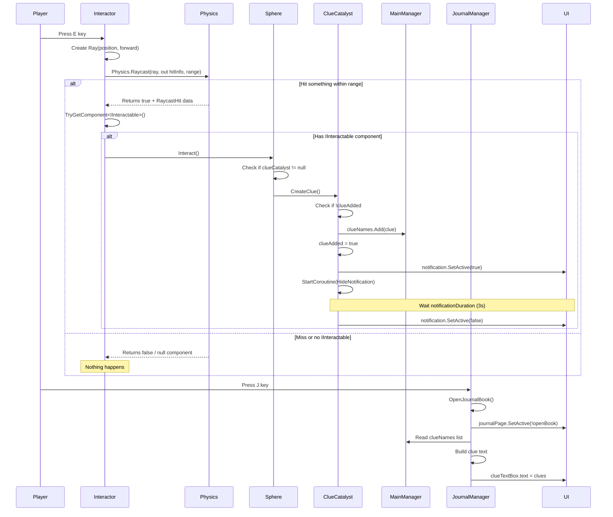
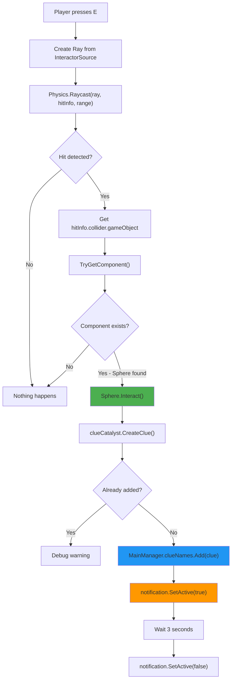

	2025-11-29 20:40

Status:

Tags:

---
# Raycast Interactor Flow with Clues

## Complete Interaction Chain


## Detailed Step-by-Step Flow

### 1. Input Detection (Interactor.cs)
```
// Every frame in Update()
if (Input.GetKeyDown(KeyCode.E))
{
    // Create a ray from camera/player forward
    Ray r = new Ray(InteractorSource.position, InteractorSource.forward);
    
    // Cast the ray
    if (Physics.Raycast(r, out RaycastHit hitInfo, InteractorRange))
    {
        // Try to get IInteractable component
        if (hitInfo.collider.gameObject.TryGetComponent(out IInteractable interactObj))
        {
            interactObj.Interact(); // Polymorphic call
        }
    }
}

```
**Variables:**
•	InteractorSource (Transform) - Usually the camera transform
•	InteractorRange (float) - Max distance to interact (e.g., 3-5 units)
•	r (Ray) - Direction from player forward
•	hitInfo (RaycastHit) - Contains collision data (collider, point, normal, etc.)
•	interactObj (IInteractable) - Interface reference to interactable object

### 2. Interface Implementation (Sphere.cs)
```
public class Sphere : MonoBehaviour, IInteractable
{
    private ClueCatalyst clueCatalyst; // Reference set in Awake()
    
    public void Interact()
    {
        // Called by Interactor when player presses E while looking at sphere
        if (clueCatalyst != null)
        {
            clueCatalyst.CreateClue();
        }
    }
}
```
**Key Points:**
•	Any GameObject with Sphere component can be interacted with
•	The sphere delegates clue creation to ClueCatalyst
•	This follows Single Responsibility Principle (separation of concerns)

### 3. Clue Creation (ClueCatalyst.cs)
```
public void CreateClue()
{
    // Prevent duplicate clues
    if (clue != null && !clueAdded)
    {
        clueAdded = true; // Mark as added
        
        // Add to global clue list
        MainManager.mainManager.clueNames.Add(clue);
        
        // Show notification UI
        if (notification != null)
        {
            notification.SetActive(true);
            StartCoroutine(HideNotificationAfterDelay());
        }
    }
}

```
**Variables:**
•	clue (string) - Serialized in Inspector (e.g., "Strange markings on the wall")
•	clueAdded (bool) - Prevents duplicate additions
•	notification (GameObject) - UI popup shown when clue collected
•	notificationDuration (float) - How long notification shows (default: 3s)

### 4. Global Storage (MainManager.cs)
```
// MainManager stores all collected clues
public List<string> clueNames = new List<string>();
```
This list is accessed by:
•	ClueCatalyst (adds clues)
•	JournalManager (reads clues for display)

### 5. Journal Display (JournalManager.cs)
```
private void Update()
{
    if (Input.GetKeyDown(KeyCode.J))
    {
        OpenJournalBook();
    }
}

public void OpenJournalBook()
{
    openBook = !openBook; // Toggle state
    CreatePage();         // Show/hide UI
    WriteQuests();        // Populate with clues
}

private void WriteQuests()
{
    if (MainManager.mainManager.clueNames.Count == 0)
    {
        // Show random placeholder text
        clueTextBox.text = noClueText[Random.Range(0, noClueText.Length)];
    }
    else
    {
        // Build clue list
        StringBuilder stringBuilder = new();
        foreach (string clue in MainManager.mainManager.clueNames)
        {
            stringBuilder.AppendLine(clue);
        }
        clueTextBox.text = stringBuilder.ToString();
    }
}

```

## Visual Raycast Diagram


---
# Reference
