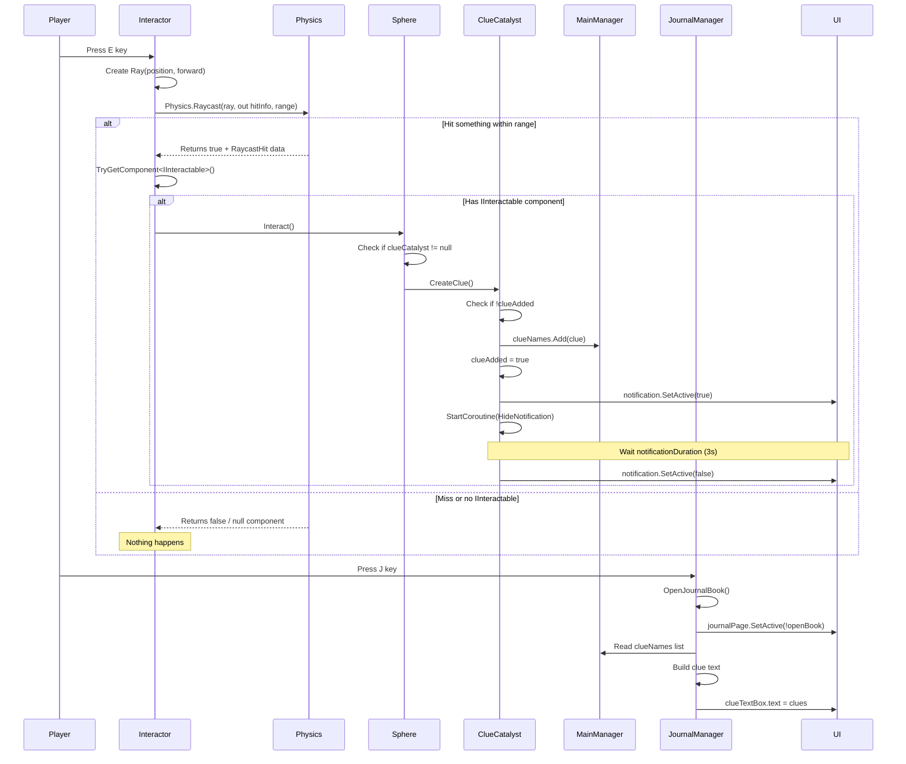

	2025-11-29 20:40

Status:

Tags:

---
# Raycast Interactor Flow with Clues

## 1. Complete Interaction Chain

```mermaid
sequenceDiagram
    participant Player
    participant Interactor
    participant Physics
    participant Sphere
    participant ClueCatalyst
    participant MainManager
    participant JournalManager
    participant UI
    
    Player->>Interactor: Press E key
    Interactor->>Interactor: Create Ray(position, forward)
    Interactor->>Physics: Physics.Raycast(ray, out hitInfo, range)
    
    alt Hit something within range
        Physics-->>Interactor: Returns true + RaycastHit data
        Interactor->>Interactor: TryGetComponent<IInteractable>()
        
        alt Has IInteractable component
            Interactor->>Sphere: Interact()
            Sphere->>Sphere: Check if clueCatalyst != null
            Sphere->>ClueCatalyst: CreateClue()
            
            ClueCatalyst->>ClueCatalyst: Check if !clueAdded
            ClueCatalyst->>MainManager: clueNames.Add(clue)
            ClueCatalyst->>ClueCatalyst: clueAdded = true
            ClueCatalyst->>UI: notification.SetActive(true)
            ClueCatalyst->>ClueCatalyst: StartCoroutine(HideNotification)
            
            Note over ClueCatalyst,UI: Wait notificationDuration (3s)
            ClueCatalyst->>UI: notification.SetActive(false)
        end
    else Miss or no IInteractable
        Physics-->>Interactor: Returns false / null component
        Note over Interactor: Nothing happens
    end
    
    Player->>JournalManager: Press J key
    JournalManager->>JournalManager: OpenJournalBook()
    JournalManager->>UI: journalPage.SetActive(!openBook)
    JournalManager->>MainManager: Read clueNames list
    JournalManager->>JournalManager: Build clue text
    JournalManager->>UI: clueTextBox.text = clues
```

---
# Reference
