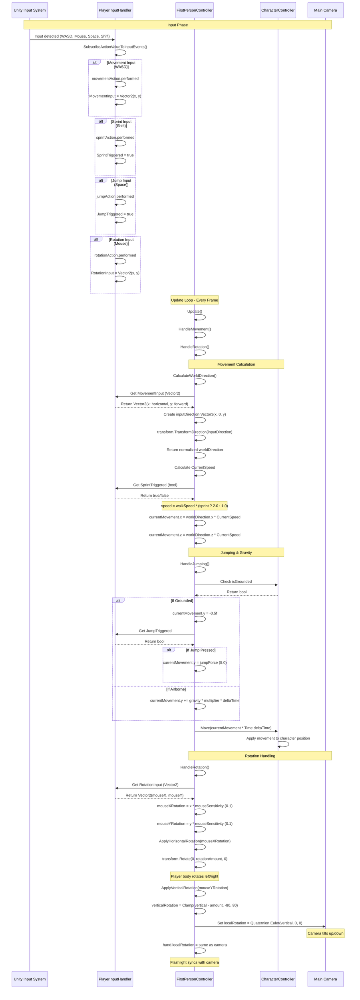

	2025-11-29 21:47

Status:

Tags:

---
# Movement Mechanics 

## Movement Mechanics Flow Diagram



## Key Variables and Their Flow

### Input Variables (PlayerInputHandler → FirstPersonController)

| Variable        | Type    | Source      | Purpose                                  |
| --------------- | ------- | ----------- | ---------------------------------------- |
| MovementInput   | Vector2 | WASD keys   | x = strafe (A/D), y = forward/back (W/S) |
| RotationInput   | Vector2 | Mouse delta | x = horizontal look, y = vertical look   |
| JumpTriggered   | bool    | Spacebar    | Triggers jump when grounded              |
| SprintTriggered | bool    | Shift key   | Multiplies movement speed by 2.0         |

### Movement Calculation Variables
```
// Step 1: Get input direction in local space
Vector3 inputDirection = new Vector3(
    playerInputHandler.MovementInput.x,  // Left/Right (-1 to 1)
    0f,                                   // No vertical component
    playerInputHandler.MovementInput.y    // Forward/Back (-1 to 1)
);

// Step 2: Convert to world space relative to player rotation
Vector3 worldDirection = transform.TransformDirection(inputDirection).normalized;

// Step 3: Calculate speed with sprint multiplier
float CurrentSpeed = walkSpeed * (SprintTriggered ? sprintMultiplier : 1);
// Result: 3.0f (walk) or 6.0f (sprint)

// Step 4: Apply to movement vector
currentMovement.x = worldDirection.x * CurrentSpeed;
currentMovement.z = worldDirection.z * CurrentSpeed;
```

### Jumping & Gravity Variables
```
if (characterController.isGrounded)
{
    currentMovement.y = -0.5f;  // Small downward force to maintain ground contact
    
    if (JumpTriggered)
    {
        currentMovement.y = jumpForce;  // 5.0f upward velocity
    }
}
else
{
    // Gravity accumulation: -9.81 * 1.0 * Time.deltaTime
    currentMovement.y += Physics.gravity.y * gravityMultiplier * Time.deltaTime;
}
```

### Rotation Variables
```
// Horizontal (Y-axis) rotation - rotates entire player body
float mouseXRotation = RotationInput.x * mouseSensitivity;  // e.g., 10 * 0.1 = 1.0°
transform.Rotate(0, mouseXRotation, 0);

// Vertical (X-axis) rotation - only camera/hand
float mouseYRotation = RotationInput.y * mouseSensitivity;
verticalRotation = Mathf.Clamp(
    verticalRotation - mouseYRotation,  // Accumulated pitch
    -upDownLookRange,                    // -80°
    upDownLookRange                      // +80°
);
mainCamera.transform.localRotation = Quaternion.Euler(verticalRotation, 0, 0);
hand.localRotation = Quaternion.Euler(verticalRotation, 0, 0);
```

### Execution Order Summary
	1.	Input System → Captures raw input (WASD, Mouse, Space, Shift)
	2.	PlayerInputHandler → Converts to properties (MovementInput, RotationInput, etc.)
	3.	FirstPersonController.Update() → Called every frame
	4.	HandleMovement() → Calculates and applies character movement
	•	CalculateWorldDirection() → Converts input to world space
	•	HandleJumping() → Manages vertical movement and gravity
	•	characterController.Move() → Applies final movement
	5.	HandleRotation() → Rotates player body and camera
	•	ApplyHorizontalRotation() → Player body Y-axis rotation
	•	ApplyVerticalRotation() → Camera/hand X-axis rotation (clamped)

The system uses Unity's CharacterController component for collision detection and movement, ensuring the player can't walk through walls and properly handles ground detection for jumping.

---
# Reference
