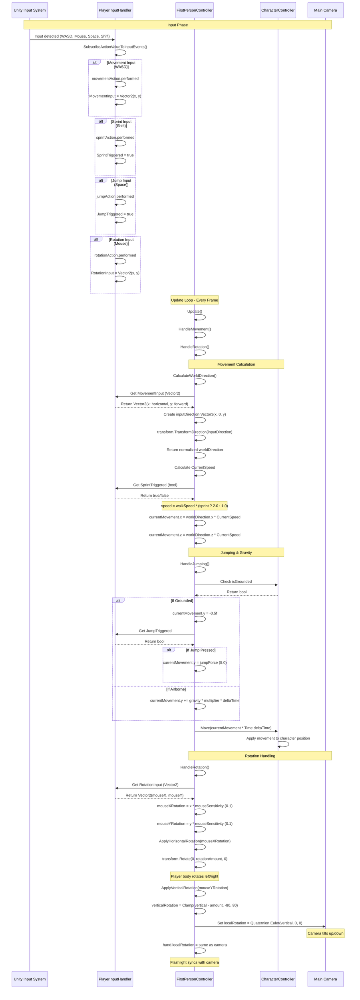

	2025-11-29 21:47

Status:

Tags:

---
# Movement Mechanics

```mermaid
sequenceDiagram
    participant Input as Unity Input System
    participant PIH as PlayerInputHandler
    participant FPC as FirstPersonController
    participant CC as CharacterController
    participant Camera as Main Camera

    Note over Input,Camera: Input Phase
    Input->>PIH: Input detected (WASD, Mouse, Space, Shift)
    PIH->>PIH: SubscribeActionValueToInputEvents()
    
    alt Movement Input (WASD)
        PIH->>PIH: movementAction.performed
        PIH->>PIH: MovementInput = Vector2(x, y)
    end
    
    alt Sprint Input (Shift)
        PIH->>PIH: sprintAction.performed
        PIH->>PIH: SprintTriggered = true
    end
    
    alt Jump Input (Space)
        PIH->>PIH: jumpAction.performed
        PIH->>PIH: JumpTriggered = true
    end
    
    alt Rotation Input (Mouse)
        PIH->>PIH: rotationAction.performed
        PIH->>PIH: RotationInput = Vector2(x, y)
    end

    Note over FPC: Update Loop - Every Frame
    FPC->>FPC: Update()
    FPC->>FPC: HandleMovement()
    FPC->>FPC: HandleRotation()

    Note over FPC,CC: Movement Calculation
    FPC->>FPC: CalculateWorldDirection()
    FPC->>PIH: Get MovementInput (Vector2)
    PIH-->>FPC: Return Vector2(x: horizontal, y: forward)
    FPC->>FPC: Create inputDirection Vector3(x, 0, y)
    FPC->>FPC: transform.TransformDirection(inputDirection)
    FPC->>FPC: Return normalized worldDirection

    FPC->>FPC: Calculate CurrentSpeed
    FPC->>PIH: Get SprintTriggered (bool)
    PIH-->>FPC: Return true/false
    Note over FPC: speed = walkSpeed * (sprint ? 2.0 : 1.0)
    
    FPC->>FPC: currentMovement.x = worldDirection.x * CurrentSpeed
    FPC->>FPC: currentMovement.z = worldDirection.z * CurrentSpeed

    Note over FPC,CC: Jumping & Gravity
    FPC->>FPC: HandleJumping()
    FPC->>CC: Check isGrounded
    CC-->>FPC: Return bool
    
    alt If Grounded
        FPC->>FPC: currentMovement.y = -0.5f
        FPC->>PIH: Get JumpTriggered
        PIH-->>FPC: Return bool
        alt If Jump Pressed
            FPC->>FPC: currentMovement.y = jumpForce (5.0)
        end
    else If Airborne
        FPC->>FPC: currentMovement.y += gravity * multiplier * deltaTime
    end

    FPC->>CC: Move(currentMovement * Time.deltaTime)
    CC->>CC: Apply movement to character position

    Note over FPC,Camera: Rotation Handling
    FPC->>FPC: HandleRotation()
    FPC->>PIH: Get RotationInput (Vector2)
    PIH-->>FPC: Return Vector2(mouseX, mouseY)
    
    FPC->>FPC: mouseXRotation = x * mouseSensitivity (0.1)
    FPC->>FPC: mouseYRotation = y * mouseSensitivity (0.1)
    
    FPC->>FPC: ApplyHorizontalRotation(mouseXRotation)
    FPC->>FPC: transform.Rotate(0, rotationAmount, 0)
    Note over FPC: Player body rotates left/right
    
    FPC->>FPC: ApplyVerticalRotation(mouseYRotation)
    FPC->>FPC: verticalRotation = Clamp(vertical - amount, -80, 80)
    FPC->>Camera: Set localRotation = Quaternion.Euler(vertical, 0, 0)
    Note over Camera: Camera tilts up/down
    FPC->>FPC: hand.localRotation = same as camera
    Note over FPC: Flashlight syncs with camera

```
---
# Reference
