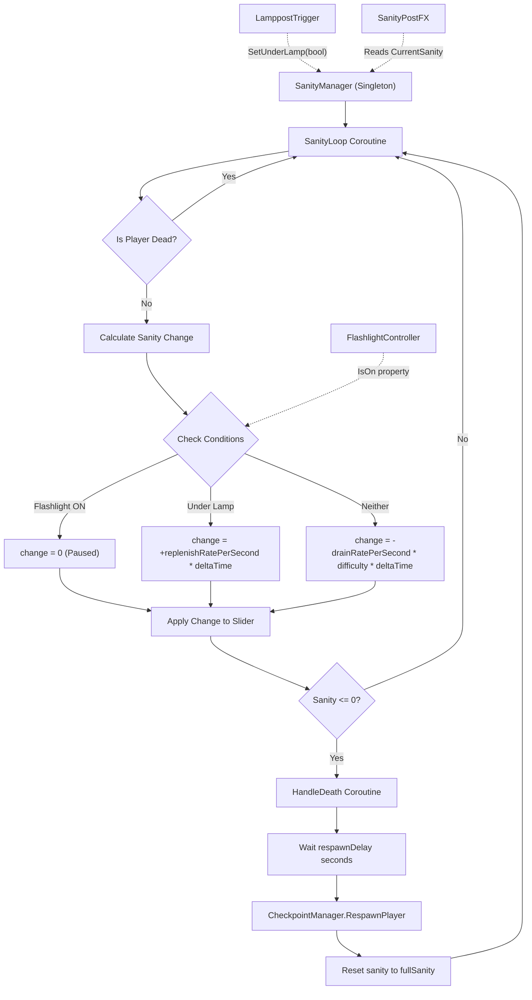

	2025-11-29 20:12

Status:

Tags:

---
# SanityMechanics

## Sanity Mechanics Flow Breakdown

### Overview Architecture

```mermaid
graph TD
    A["SanityManager (Singleton)"] --> B["SanityLoop Coroutine"]
    B --> C{Is Player Dead?}
    C -->|Yes| B
    C -->|No| D["Calculate Sanity Change"]
    D --> E{Check Conditions}
    E -->|Flashlight ON| F["change = 0 (Paused)"]
    E -->|Under Lamp| G["change = +replenishRatePerSecond * deltaTime"]
    E -->|Neither| H["change = -drainRatePerSecond * difficulty * deltaTime"]
    F --> I["Apply Change to Slider"]
    G --> I
    H --> I
    I --> J{Sanity <= 0?}
    J -->|Yes| K["HandleDeath Coroutine"]
    J -->|No| B
    K --> L["Wait respawnDelay seconds"]
    L --> M["CheckpointManager.RespawnPlayer"]
    M --> N["Reset sanity to fullSanity"]
    N --> B
    
    O["FlashlightController"] -.->|"IsOn property"| E
    P["LamppostTrigger"] -.->|"SetUnderLamp(bool)"| A
    Q["SanityPostFX"] -.->|"Reads CurrentSanity"| A
```

---
# Reference
