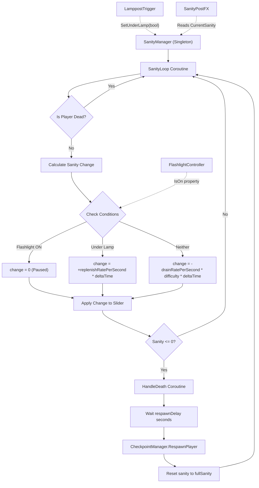

	2025-11-29 20:12

Status:

Tags:

---
# SanityMechanics

## Sanity Mechanics Flow Breakdown

### Overview Architecture


## Detailed Function Call Flow

### 1. Initialization (Start())
```
Start()
├─ Get Slider component
├─ Set sanitySlider.maxValue = fullSanity (100)
├─ Set sanitySlider.value = fullSanity (100)
└─ StartCoroutine(SanityLoop())
```

### 2. Main Loop (SanityLoop() Coroutine)
```
SanityLoop() [EVERY FRAME]
├─ Check: if (isDead) → skip frame
├─ Get Time.deltaTime → delta
├─ Increment logTimer
├─ Read flashlightController.IsOn → flashlightOn
├─ Read isUnderLamp → underLamp
│
├─ Calculate Change:
│  ├─ if (flashlightOn) → change = 0
│  ├─ else if (underLamp) → change = +replenishRatePerSecond * delta
│  └─ else → change = -drainRatePerSecond * difficulty * delta
│
├─ Snapshot before = sanitySlider.value
├─ Apply: sanitySlider.value = Clamp(value + change, 0, maxValue)
├─ Snapshot after = sanitySlider.value
│
├─ Check: if (after <= 0 && !isDead)
│  └─ StartCoroutine(HandleDeath())
│
└─ Debug Log every 1 second
```

### 3. External Influence: Lamppost Triggers
```
LamppostTrigger.OnTriggerEnter()
└─ SanityManager.Instance.SetUnderLamp(true)
    └─ isUnderLamp = true

LamppostTrigger.OnTriggerExit()
└─ SanityManager.Instance.SetUnderLamp(false)
    └─ isUnderLamp = false
```

### 4. External Influence: Flashlight Controller
```
FlashlightController.SetState(bool on)
├─ Check if overheated (blocks turning ON)
├─ Check if under lamp (blocks turning ON)
├─ isOn = on
└─ ApplyState()

// Read by SanityManager each frame:
SanityLoop() reads → flashlightController.IsOn
```

### 5. Death & Respawn Flow (HandleDeath() Coroutine)
```
HandleDeath()
├─ Set isDead = true (pauses sanity updates)
├─ Debug.Log("Player has lost all sanity!")
├─ yield WaitForSeconds(respawnDelay) [2 seconds default]
│
├─ CheckpointManager.Instance.RespawnPlayer()
│  └─ [Moves player to last checkpoint position]
│
├─ Reset: sanitySlider.value = fullSanity (100)
├─ Set isDead = false (resumes sanity updates)
└─ Debug.Log("Player respawned with full sanity.")
```

### 6. Visual Feedback (SanityPostFX - External Reader)
```
SanityPostFX.Update() [EVERY FRAME]
├─ Read: sanity = SanityManager.Instance.CurrentSanity
├─ Read: maxSanity = SanityManager.Instance.fullSanity
├─ Calculate: t = 1 - (sanity / maxSanity)
│   └─ t = 0 (healthy) to 1 (insane)
│
├─ targetChromatic = Lerp(chromaticMin, chromaticMax, t)
├─ targetLens = Lerp(lensMin, lensMax, t)
├─ targetVolume = Lerp(audioMin, audioMax, t)
│
└─ Smoothly interpolate post-processing effects
```

## Key Variables Summary
| Variable                  | Type  | Purpose                | Typical Values |
| ------------------------- | ----- | ---------------------- | -------------- |
| fullSanity                | int   | Max sanity capacity    | 100            |
| difficulty                | int   | Drain rate multiplier  | 1              |
| replenishRatePerSecond    | float | Sanity gain under lamp | 10.0           |
| drainRatePerSecond        | float | Base sanity loss rate  | 2.0            |
| respawnDelay              | float | Death to respawn time  | 2.0 seconds    |
| isUnderLamp               | bool  | Player in lamp zone    | true/false     |
| isDead                    | bool  | Player death state     | true/false     |
| sanitySlider.value        | float | Current sanity         | 0-100          |
| flashlightController.IsOn | bool  | Flashlight active      | true/false     |


---
# Reference
